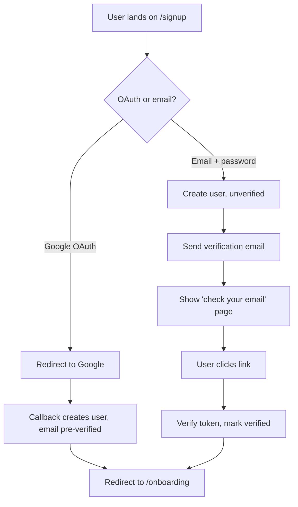
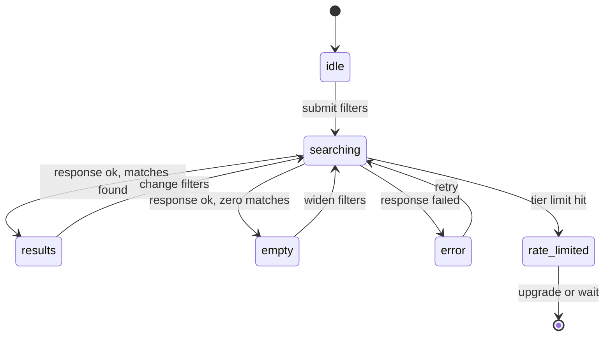
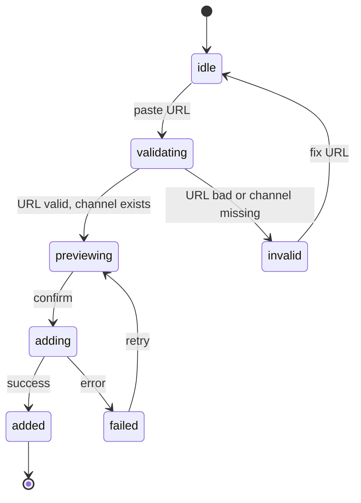
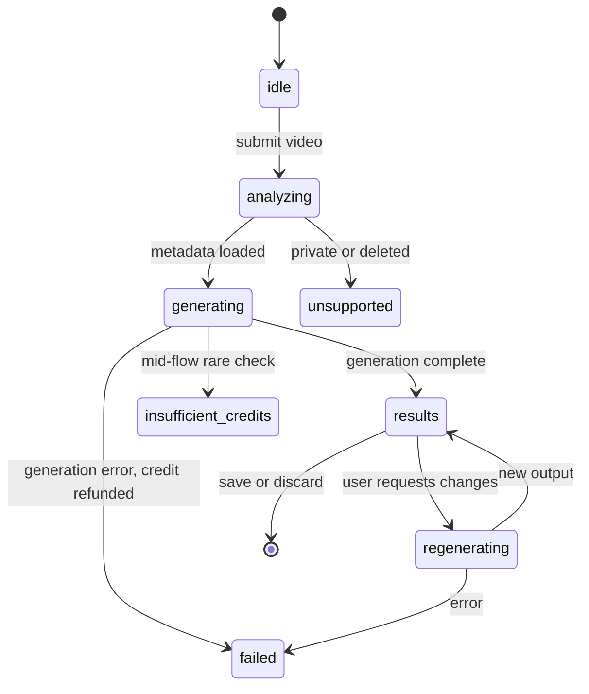
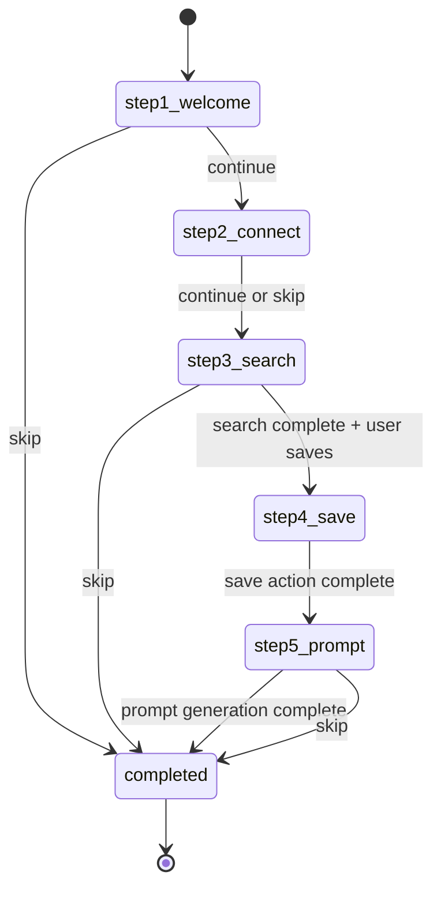
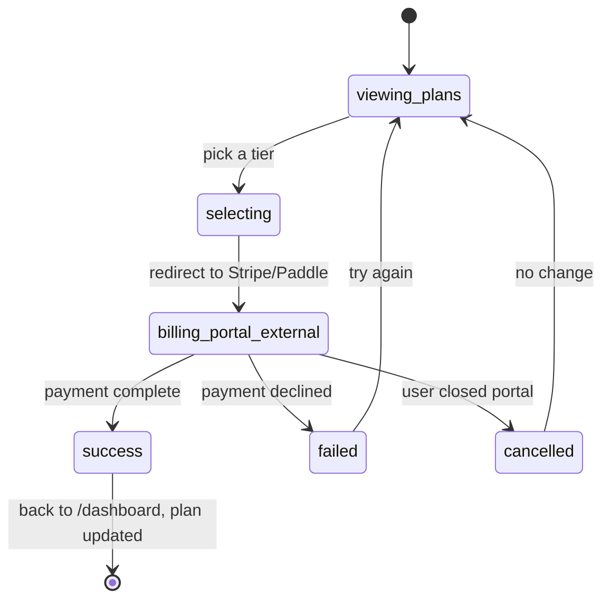

# YTNiches — Application Flow

2026-09-19 · @Someone

---

## 1. Overview

This doc specifies how the app flows — routes, sessions, state transitions, error paths. It sits alongside UI-UX-Flow.md (which specs what's on each screen) and PRD.md (which specs what features exist).

**What this doc covers:**

- URL structure and page hierarchy
- Auth and session lifecycle (signup, login, timeout, refresh, impersonation)
- State machines for each MVP feature (what states exist, what triggers transitions)
- Error handling paths (404, 500, auth failure, rate limit, offline)
- Deep-link and shareable-URL behavior

**What this doc does NOT cover:**

- Screen layouts (see UI-UX-Flow.md)
- API contracts (see TRD.md once written)
- DB schema (see Backend-Schema.md once written)
- Security policies beyond auth flow (see Security.md once written)

**How to read this doc:**

Routes are grouped by public vs authenticated. State machines are shown as Mermaid diagrams where useful. Every user-visible error state has an explicit spec here — no handling is left to "developer judgment".

## 2. URL Routing & Page Hierarchy

Next.js App Router. Routes grouped by access requirement. Dynamic segments use `[param]` notation.

### 2.1 Public routes (no auth required)

| Route                     | Page             | Notes                    |
| ------------------------- | ---------------- | ------------------------ |
| `/`                       | Landing          | Marketing home           |
| `/blog`                   | Blog homepage    | Featured + category rows |
| `/blog/[slug]`            | Blog post        | MDX-rendered             |
| `/blog/categories/[slug]` | Category page    | Filtered post list       |
| `/blog/authors/[slug]`    | Author page      | Author bio + their posts |
| `/blog/tags/[slug]`       | Tag page         | Filtered post list       |
| `/blog/rss.xml`           | RSS feed         | Auto-generated           |
| `/``tools`                | Free tools index | List of all tools        |
| `/`                       | Free tool        | Individual tool          |
| `/tutorials`              | Tutorials index  | Long-form guides list    |
| `/tutorials/[slug]`       | Tutorial page    | Long-form guide          |
| `/vs/[competitor]`        | VS page          | Comparison page          |
| `/pricing`                | Pricing          | Full pricing tiers       |
| `/legal/terms`            | Terms of service | Static                   |
| `/legal/privacy`          | Privacy policy   | Static                   |
| `/legal/cookies`          | Cookie policy    | Static                   |

### 2.2 Auth routes (public but redirect if already logged in)

| Route                       | Page            | Notes                                      |
| --------------------------- | --------------- | ------------------------------------------ |
| `/signup`                   | Signup          | Redirects to `/dashboard` if authed        |
| `/login`                    | Login           | Redirects to `/dashboard` if authed        |
| `/forgot-password`          | Forgot password | Email input                                |
| `/reset-password?token=...` | Reset password  | From email link                            |
| `/verify?token=...`         | Email verify    | From email link, auto-redirects on success |

### 2.3 Authenticated routes (require session)

| Route                           | Page                         | Notes                                                             |
| ------------------------------- | ---------------------------- | ----------------------------------------------------------------- |
| `/dashboard`                    | Dashboard                    | Default post-login landing                                        |
| `/onboarding`                   | Onboarding                   | Only if not yet completed; skippable                              |
| `/niches`                       | Niche Finder                 | `?tab=niches` (default), `channels`, `outliers`, `search` (D-069) |
| `/niches/[slug]`                | Niche detail                 | Score breakdown + trend; slug `channels` reserved                 |
| `/niches/channels/[channelId]`  | Channel detail               | Deep-linkable                                                     |
| `/outliers`                     | Outliers (tracked channels)  | Per-user feed (D-037); global feed is `/niches?tab=outliers`      |
| `/tracking`                     | Competitor Tracking overview | Activity feed                                                     |
| `/tracking/[channelId]`         | Per-channel tracking         | Deep-linkable                                                     |
| `/tracking/compare?ids=id1,id2` | Compare view                 | Multi-channel                                                     |
| `/prompts`                      | AI Prompts                   | Library + generator                                               |
| `/prompts/[promptId]`           | Prompt detail                | Deep-linkable                                                     |
| `/calendar`                     | Content Calendar             | Phase 3, redirects to `/dashboard` in Phase 1                     |
| `/workspace`                    | Workspace overview           | Phase 3                                                           |
| `/settings`                     | Settings redirect            | → `/settings/profile`                                             |
| `/settings/profile`             | Profile settings             |                                                                   |
| `/settings/notifications`       | Notification settings        |                                                                   |
| `/settings/billing`             | Billing settings             |                                                                   |
| `/settings/connections`         | Connections settings         |                                                                   |
| `/settings/preferences`         | Preferences                  |                                                                   |
| `/settings/danger`              | Danger zone                  |                                                                   |

### 2.4 Admin routes (super-admin role only)

| Route                   | Page                     | Notes                               |
| ----------------------- | ------------------------ | ----------------------------------- |
| `/admin`                | Admin dashboard redirect | → `/admin/dashboard`                |
| `/admin/dashboard`      | Admin dashboard          | KPIs + health                       |
| `/admin/users`          | Users list               | Search + filter                     |
| `/admin/users/[userId]` | User detail              | Impersonate action                  |
| `/admin/blog`           | Blog CMS                 | Post management                     |
| `/admin/revenue`        | Revenue                  | MRR + charts                        |
| `/admin/api-quotas`     | API Quotas               | YouTube usage, per-source breakdown |
| `/admin/discovery`      | Discovery Engine         | Seeds + manual job triggers (D-069) |
| `/admin/tools`          | Admin tools              | Recompute, cache, flags             |
| `/admin/automation`     | Automation Tools         | Job control                         |

### 2.5 Query param conventions

- Filters: use query params so state is shareable and browser-navigable. Example: `/niches?subs=1000-100000&lang=en&country=US`
- Modal state: sometimes uses `?modal=<name>` for deep-linkable modals
- Sort: `?sort=avg_views&dir=desc`
- Pagination: `?page=2` (server-rendered) or infinite scroll (no param)

### 2.6 Redirect rules

- Unauthenticated user hits `/dashboard` (or any auth route) → redirect to `/login?redirect=<original>` → return there after login
- Authenticated user without completed onboarding hits `/dashboard` → redirect to `/onboarding` (skippable)
- Non-super-admin hits `/admin/*` → hard 403 page (not silent redirect)
- Missing route → `/404` page

## 3. Auth & Session Flow

### 3.1 Signup

As built (D-083): the email link opens `/auth/confirm?token_hash=…&type=email`, which verifies the token (any browser) and then follows the same path as Google. "Check your email" is `/check-email`. The address rides in a short-lived HttpOnly cookie, not the URL, and resends are capped at 3 per hour.

### 3.2 Login

- User lands on `/login`
- Choice: Google OAuth OR email + password
- Success → session cookie set → redirect to `?redirect=<original>` or `/dashboard`
- Failure → inline error + "Forgot password" link
- Rate limit: 5 failed attempts / 15 min per IP → temporary lockout

### 3.3 Session lifecycle

- Cookie: HttpOnly, Secure, SameSite=Lax, name: `sb-access-token` (Supabase Auth default)
- Default lifetime: 30 days rolling
- Refresh: on any authenticated request, session TTL extends by 30 days
- Manual logout: clears cookie + revokes session server-side
- Multi-device: sessions per device; list + revoke individual sessions in `/settings/security` (Phase 2)

### 3.4 Password reset (email + password users only)

- `/forgot-password` → email input → send reset link
- Reset link expires in 60 minutes (the same 1-hour setting as verification links)
- The reset link opens `/auth/confirm?token_hash=…&type=recovery` → verify token → session plus a 15-minute recovery cookie → `/reset-password` → new password form → update password → `/dashboard` (D-083)
- All existing sessions for the account invalidated on password change

### 3.5 Email change

- `/settings/profile` → change email → send verification to new address
- User confirms in new email → update email in DB
- Notification email sent to old address ("your account email was changed")
- OAuth-only users cannot change email (must change in Google)

### 3.6 Impersonation (admin)

- Super-admin on `/admin/users/[userId]` clicks "Impersonate"
- System creates impersonation session with flag + original admin's user ID stored
- Full app access as target user
- Persistent warning-color banner at top: "Impersonating \[name\] — Stop"
- Stop → destroys impersonation session, returns admin to `/admin/users/[userId]`
- All actions during impersonation logged with both admin ID and target ID
- Impersonation cannot: change password, delete account, change billing

## 4. Feature State Machines

### 4.1 Niche Finder search

### 4.2 Add channel to tracking

### 4.3 AI Prompts generation

### 4.4 Onboarding

Skip transitions from any step → `completed` (with step number stored so "finish onboarding" banner links back).

### 4.5 Billing upgrade

**Webhook handling:** payment confirmation via webhook (Stripe/Paddle) is source of truth, not the redirect. Portal redirect success + webhook not received in 60s → show "processing…" state with support link.

_(Note, 2026-09-22: provider is Creem.io per D-010/Monetization.md §4, not Stripe/Paddle — the state machine and webhook-is-source-of-truth rule above hold unchanged, "Stripe/Paddle" is just stale naming.)_

## 5. Error Handling & Edge Cases

### 5.1 HTTP error pages

- **404** — friendly page: illustrated icon + "That page doesn't exist" + navigation to home / search / help
- **500** — apology + status page link (`status.ytniches.com` if set up) + retry button + support email
- **403** — for admin routes attempted by non-admins; "You don't have access here" + link back to `/dashboard`
- **429** (rate limit) — "Slow down" message + retry-after countdown

### 5.2 Auth failures

- **Expired session** → redirect to `/login?redirect=<original>&reason=expired` → login form shows "Your session expired, please log in again"
- **Invalid token** (URL param) → redirect to `/login?reason=invalid` → "That link is no longer valid"
- **Account disabled** → `/account-disabled` page with contact support link

### 5.3 API failures

- Client-side retry with exponential backoff (100ms → 400ms → 1600ms), max 3 retries
- After 3 retries: show feature-specific error state (see UI-UX-Flow.md §5.4, §6.6, §7.6)
- Offline detection (navigator.onLine + failed heartbeat): global banner "You're offline. Some features unavailable."

### 5.4 Rate limits & quotas

- **YouTube API quota:** if response is cached within staleness window, serve cached; else show "Data may be up to X hours old" banner
- **User tier limit** (searches / prompts / tracked channels): show inline upgrade CTA in the feature
- **IP-based rate limit** (429 from Next.js middleware): global banner with retry-after
- **Cost breaker** (see Implementation-Plan.md §6.1): if AI cost per user exceeds cap, feature disabled for that user with support message

### 5.5 Third-party outages

- **Supabase down** — read-only mode banner "Some features are temporarily unavailable"; writes queue in local storage where possible, retry on reconnect
- **YouTube API down** — data pages show stale data with banner "Latest sync failed at \[time\]"
- **Billing provider down** — block new upgrades with "Try again in a few minutes"; existing paid users unaffected
- **AI provider down** — AI Prompts feature disabled with banner; queued jobs retry when service returns

### 5.6 Data edge cases

- **Deleted YouTube channel** — soft-delete in our DB with `unavailable_since` timestamp; channel detail page shows "Channel unavailable" with archived data still visible
- **Deleted YouTube video** — keep prompt data; mark source as `unavailable`; "Video unavailable" badge on video references
- **Private / unlisted video** — same handling as deleted; retry weekly in case status changes
- **User cancels mid-onboarding** — preserve state, resume where left off next login (via `onboarding_step` field on user record)
- **User deletes account** — 30-day soft-delete window (recoverable via support); after 30 days, hard-delete per Security.md retention policy
- **Channel changes ID** (rare) — detect via handle lookup; migrate all references, log migration event

### 5.7 Deep-link handling

- All feature URLs are shareable and deep-linkable
- Unauthenticated access to a deep link → redirect to `/login?redirect=<url>` → return after login
- Deep link to something the user doesn't have access to (e.g. someone else's tracked channel) → 404 (not 403, to avoid leaking existence)
- Deep link to something deleted → friendly "This no longer exists" page + back link

### 5.8 Concurrent action edge cases

- **Duplicate save** — idempotent: saving an already-saved channel returns success silently, no duplicate row
- **Double-click on generate** — button disables during generation; server-side idempotency key prevents duplicate credit charge
- **Session in two tabs** — shared session cookie; logout in one tab → next request in other tab redirects to `/login`
