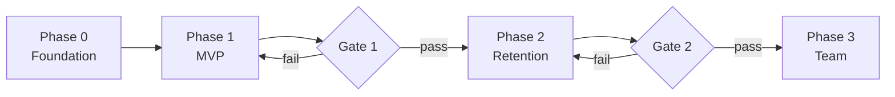

# YTNiches — Implementation Plan

2026-09-19 · @Someone

---

## 1. Overview & Principles

This plan is the build sequence for YTNiches. It exists because the previous MVP failed on execution drift — the developer built without hard checkpoints, and by the time issues surfaced, too much was wrong to salvage cheaply.

**How this plan is different:**

1. **Backend-first phasing.** Every phase ends with something running end-to-end, not with half-finished features across three layers.
2. **Phase gates block progression.** No Phase 2 work begins until Phase 1 passes its gate. Gates are objective (see Section 5).
3. **Weekly demo checkpoints.** Every Friday, the developer walks Mac through what shipped that week against the spec. No demo = the week is treated as not shipped.
4. **Doc-locked scope.** No feature enters build without its spec doc (PRD + relevant sub-spec). Scope changes go through DECISIONS.md, never verbal or Slack-only.
5. **Rollback triggers are pre-committed.** Section 6 names the triggers that stop or revert work — decided now, when emotions are neutral, not during a crisis.

**Phases at a glance:**

**Rough timeline (indicative, not committed):**

| Phase   | Duration  | End-state                                                                            |
| ------- | --------- | ------------------------------------------------------------------------------------ |
| Phase 0 | 2–3 weeks | Repo + DB + auth + design system deployed, one hello-world page live                 |
| Phase 1 | 6–8 weeks | MVP shipped: Niche Finder + Competitor Tracking + AI Prompts + Onboarding, monetized |
| Phase 2 | 4–6 weeks | Retention layer: Outlier Finder + Notifications + Thumbnail Ideas                    |
| Phase 3 | 6–8 weeks | Team layer: Workspace + Tasks + Content Calendar                                     |

Total: 18–25 weeks from Phase 0 kickoff to Phase 3 complete. Landing site build runs partially in parallel (see Section 4).

## 2. Phase 0 — Foundation (2–3 weeks)

Goal: everything a feature needs to exist before feature work begins. No user-facing product yet, but every subsequent phase depends on this being solid.

### 2.1 Repo & environment

- Next.js 14+ (App Router) + TypeScript strict mode
- Tailwind CSS with tokens from Design-System.md
- ESLint + Prettier + Husky pre-commit hooks
- pnpm workspaces (if monorepo later; single package for now)
- `.env.example` committed; real `.env` gitignored
- README with setup steps, seed script, common commands

### 2.2 CI / CD

- GitHub Actions: lint + typecheck + test on every PR
- Vercel connected for preview deploys per PR
- Production deploys from `main` branch only
- Environment separation: `dev`, `preview`, `production` Supabase projects

### 2.3 Database & auth

- Supabase project provisioned (dev + prod)
- Base tables: `users`, `subscriptions`, `usage_events` (schema per Backend-Schema.md when written)
- Row-Level Security (RLS) policies enabled from day 1 — never `bypass_rls` outside migrations
- Supabase Auth wired with Google OAuth + email/password (pending D-015 resolution)
- Session handling via Next.js middleware

### 2.4 Design system in code

> Note: Tailwind v4 is installed. Design tokens live in app/globals.css as @theme blocks, not tailwind.config.ts. Update this section before §2.4 work starts.

- `tailwind.config.ts` implementing tokens from Design-System.md
- Storybook set up with dark mode as default
- Base components built + storied: Button, Input, Card, Table, Sidebar, Modal, Empty/Loading/Error states
- Component contract: every component has stories for all variants + states

### 2.5 Observability

- Sentry (or equivalent) for error tracking, wired to Slack/email for critical errors
- Basic analytics: PostHog or Plausible (choose in DECISIONS.md before Phase 1)
- Structured logging for backend jobs

### 2.6 Phase 0 exit checklist

- [ ] Repo boots on any developer machine with `pnpm install && pnpm dev`
- [ ] CI passes on a sample PR (lint + type + test all green)
- [ ] Preview deploy generates a working URL on PR
- [ ] User can sign up via Google OAuth and see a placeholder dashboard
- [ ] Storybook has all base components with dark + light stories
- [ ] Sentry catches a deliberately thrown error and alerts
- [ ] RLS policies tested — users cannot read other users' rows

Only when every checklist item is green does Phase 1 begin.

## 3. Phase 1 — MVP (6–8 weeks)

Goal: launch the four MVP features (Niche Finder, Competitor Tracking, AI Prompts, Onboarding) with billing, monetization, and a marketing landing page live. Backend-first within each feature — API + data flow works before UI polish.

### 3.1 Feature build order

Built sequentially, not in parallel. Each feature gets its own sub-checkpoint before the next starts.

| Order | Feature                | Duration                  | Why this order                                                                                    |
| ----- | ---------------------- | ------------------------- | ------------------------------------------------------------------------------------------------- |
| 1     | Niche Finder           | 2 weeks                   | Entry point of the product loop; hardest data problem to solve; validates YouTube API quota model |
| 2     | Competitor Tracking    | 1.5 weeks                 | Consumes Niche Finder output; needed before AI Prompts (which extracts from tracked videos)       |
| 3     | AI Prompts             | 1.5 weeks                 | Requires Competitor Tracking to source videos from; validates AI cost per free user               |
| 4     | Onboarding             | 1 week                    | Written last so it can reflect the actual product flow, not a guessed one                         |
| 5     | Billing + Monetization | 1 week (parallel with #4) | Blocks launch; wire Stripe/Paddle + credit metering + upgrade prompts                             |

### 3.2 Per-feature build pattern

Every MVP feature follows the same internal sequence:

1. **Data layer** — Backend-Schema.md tables + migrations shipped, RLS policies tested
2. **Backend endpoints** — API routes with typed responses, unit tests for edge cases
3. **Background jobs** (if applicable) — scheduled polling, cost tracking
4. **Frontend data hooks** — React Query (or equivalent) with loading + error + empty states
5. **UI components** — assembled from Storybook primitives; no new base components in feature work
6. **Demo to Mac** — Friday of the week; end-to-end walkthrough against the spec
7. **Iteration** — fix / clarify based on Mac's feedback
8. **Sub-checkpoint** — feature merged to main, deployed to preview, accessible via seeded test account

### 3.3 Landing page track (parallel)

Runs alongside product build. Blocked on landing-copy discovery (D-020) closing before content freeze.

- Week 1–2 of Phase 1: Founder voice discovery + Landing-Copy.md drafted (Mac + Claude)
- Week 2–4: Illustrations commissioned or generated (Midjourney/DALL·E workflow if no designer)
- Week 4–6: Developer implements Landing-Page-Spec.md sections in parallel with product
- Week 6–7: Hero video shot + edited
- Week 7–8: Landing + product launch together

### 3.4 Phase 1 exit checklist

- [ ] All four MVP features shipped and accessible in preview
- [ ] Billing works end-to-end: signup → trial → paid → credit consumption → upgrade prompt
- [ ] Landing page live on production domain
- [ ] Sentry error rate below 1% of sessions in the last 7 days
- [ ] YouTube API quota usage projected to stay within budget at 500 users
- [ ] At least 20 external beta users completed onboarding and generated at least one prompt
- [ ] Basic analytics events firing: signup, first\_search, first\_save, first\_prompt, upgrade\_clicked, upgrade\_completed
- [ ] Documentation: user-facing help center has articles for each MVP feature

Phase 2 does not start until every item is green.

## 4. Phases 2 + 3 — Forward Look

Lighter detail here than Phase 1 because specs will iterate based on Phase 1 usage data. This section names the sequence and dependencies; per-feature specs come later.

### 4.1 Phase 2 — Retention Layer (4–6 weeks)

Goal: drive weekly return visits with high-signal features that build on the MVP data foundation.

**Build order:**

| Order | Feature         | Depends on                         | Why this order                                     |
| ----- | --------------- | ---------------------------------- | -------------------------------------------------- |
| 1     | Outlier Finder  | Competitor Tracking data (Phase 1) | Uses existing tracked channels; no new data source |
| 2     | Notifications   | Outlier Finder + Tracking          | Needs triggers to notify about                     |
| 3     | Thumbnail Ideas | AI Prompts infra                   | Extends existing AI pipeline                       |

**Phase 2 gate to Phase 3:**

- [ ] 30-day retention above target set post-launch baseline
- [ ] Notification opt-in rate above 50% of users who see the setting
- [ ] Outlier Finder used at least once by more than 40% of active users
- [ ] No P0 or P1 bugs open in production

---

### 4.2 Phase 3 — Team Layer (6–8 weeks)

Goal: unlock team-tier pricing and turn YTNiches from an individual tool into a small-team platform.

**Build order:**

| Order | Feature          | Depends on                     | Why this order                                      |
| ----- | ---------------- | ------------------------------ | --------------------------------------------------- |
| 1     | Workspace        | Auth + billing (Phase 0/1)     | Foundational for the other two; needs role model    |
| 2     | Tasks            | Workspace                      | Assignments require workspace members               |
| 3     | Content Calendar | Workspace + Tasks + AI Prompts | Ties every other feature together; heaviest UI work |

**Phase 3 gate to "post-launch" (no more phase gates, moves to continuous):**

- [ ] Team tier adopted by more than 10% of paid users
- [ ] Calendar drag-and-drop works reliably across day / week / month views on desktop + mobile-web
- [ ] Slack notifications tested for team accounts
- [ ] Onboarding updated to reflect team option

---

### 4.3 What comes after Phase 3

No pre-committed roadmap beyond Phase 3. The next quarter of work is decided based on usage data, churn signals, and open decisions in DECISIONS.md that resurface after production experience.

## 5. Checkpoints & Phase Gates

Three checkpoint types, each with a different weight. If a checkpoint fails, work stops until the failure is resolved — no "we'll fix it next week" bypasses.

### 5.1 Weekly demo checkpoint (every Friday)

**Format:** 30-minute call, developer walks Mac through what shipped that week against the relevant spec doc.

**Pass criteria:**

- Features shipped match the week's spec-defined scope
- Live in preview environment (not localhost demo)
- Mac can reproduce the demo himself after the call
- No P0 or P1 bugs introduced

**Fail response:**

- Roll the incomplete work into next week's scope
- Update the timeline honestly — never hide slippage
- If the same failure repeats two weeks running, trigger a scope conversation (see 5.3)

### 5.2 Sub-feature checkpoint (per MVP feature)

**When:** at the end of each Phase 1 feature's build (Niche Finder done, Competitor Tracking done, etc.)

**Pass criteria:**

- Data layer + backend + frontend all wired and testable end-to-end
- Spec fully implemented (or documented exceptions in DECISIONS.md)
- Test account can perform the feature's primary flow from onboarding entry point
- No known regressions in previously-shipped features

**Fail response:**

- Do not start the next feature until this one passes
- If failure is spec-related (spec was wrong, not build), update the spec and re-review before moving on

### 5.3 Phase gate (between Phase 1 → 2, 2 → 3)

**When:** at end of each phase, before opening the next phase's spec work.

**Pass criteria:** the phase's exit checklist (Section 2.6, 3.4, 4.1, 4.2) is fully green.

**Fail response — three options, choose one:**

- **Extend the phase:** add 1–2 weeks and complete missing items (default choice if failure is small)
- **Re-scope the phase:** move failing items to a later phase, ship what's done (choose if failing items are lower-priority)
- **Halt and diagnose:** stop new work, run a retrospective on what went wrong, then decide (choose if multiple items failed or if quality is systemically off)

Halting is not failure — it's the response that prevents the last MVP's outcome.

### 5.4 Communication cadence

| Cadence       | What                            | Format                                                              |
| ------------- | ------------------------------- | ------------------------------------------------------------------- |
| Daily (async) | Progress note in shared channel | 2–4 lines: what shipped yesterday, what's shipping today, blockers  |
| Weekly        | Demo + planning                 | 30-min call, notes captured in a `weekly-log.md` in the repo        |
| Per-feature   | Sub-checkpoint review           | 45-min call, notes go in the feature's spec doc as a review section |
| Per-phase     | Phase gate review               | 60-min call + written go/no-go decision in DECISIONS.md             |

## 6. Rollback Triggers & Risk Register

Decided now, when emotions are neutral. These triggers exist so the decision to stop, revert, or re-scope isn't made under pressure in the moment.

### 6.1 Automatic rollback triggers (production)

Any of these fires → revert the latest deploy immediately, then diagnose:

- Sentry error rate crosses 5% of sessions in a 15-minute window
- Signup success rate drops below 80% of baseline
- Payment success rate drops below 90% of baseline
- Any P0 bug in billing, auth, or data integrity

**Process:** Vercel rollback + Slack alert + incident note in `incidents/` folder in repo. Root cause before re-deploy.

### 6.2 Phase halt triggers

Any of these fires → pause phase, run a retrospective before deciding whether to continue, re-scope, or restart:

- Two consecutive weekly demos fail their pass criteria
- Sub-feature checkpoint fails twice on the same feature
- YouTube API quota usage projects to exceed budget by more than 2x at current growth rate
- AI generation cost per free user exceeds break-even for the tier
- Developer capacity drops (illness, other commitments, quality issues) for more than 1 week

### 6.3 Scope re-negotiation triggers

Any of these fires → open a DECISIONS.md entry to formally re-negotiate MVP scope:

- Any Phase 1 feature runs over its budgeted duration by more than 50%
- A hard dependency (Supabase, YouTube API, billing provider) has an unresolvable issue for more than 3 days
- User research (beta users) reveals a feature is materially wrong (not just polish issues)

### 6.4 Risk register

Known risks and their mitigations. Reviewed at each phase gate.

| Risk                                            | Likelihood | Impact | Mitigation                                                                                 |
| ----------------------------------------------- | ---------- | ------ | ------------------------------------------------------------------------------------------ |
| YouTube API quota exhaustion                    | Medium     | High   | Aggressive caching (Redis), tier-based refresh cadence, apply for higher quota early       |
| AI cost per free user exceeds LTV               | Medium     | High   | Hard credit limits on free tier, cost tracking per user in admin panel                     |
| Developer execution issues (repeat of last MVP) | Medium     | High   | Weekly demos + sub-feature checkpoints + phase gates — catch drift early, not at end       |
| Landing illustration delays                     | Medium     | Medium | Fallback: use Midjourney/DALL·E with consistent style prompts if designer unavailable      |
| Stripe/Paddle integration issues                | Low        | High   | Time-box integration to 1 week; if not working, ship with manual invoicing for early users |
| Supabase pricing at scale                       | Low        | Medium | Monitor at every phase gate; migration path to self-hosted Postgres if needed              |
| Competitor releases matching features           | Medium     | Low    | Positioning is Research + Execution loop, not a single feature — hard to match wholesale   |
| Mac's own capacity (30h/week assumption)        | Medium     | High   | Ship phases sequentially; no parallel decision-making required                             |

### 6.5 What is NOT a trigger

Explicitly not reasons to halt, revert, or re-scope:

- Individual bug reports (fix them, but don't stop shipping)
- Aesthetic preferences that emerge mid-build (log in DECISIONS.md for next iteration)
- Feature requests from beta users (log for post-launch, don't add to current phase)
- Comparisons to competitor launches (positioning is the moat, feature-for-feature is not the game)

---

**Doc dependencies:** This plan assumes PRD.md, DECISIONS.md, and Design-System.md exist and are current. Backend-Schema.md, TRD.md, Security.md, Landing-Copy.md, and Landing-Page-Spec.md must be written before their respective Phase 1 build weeks begin.
