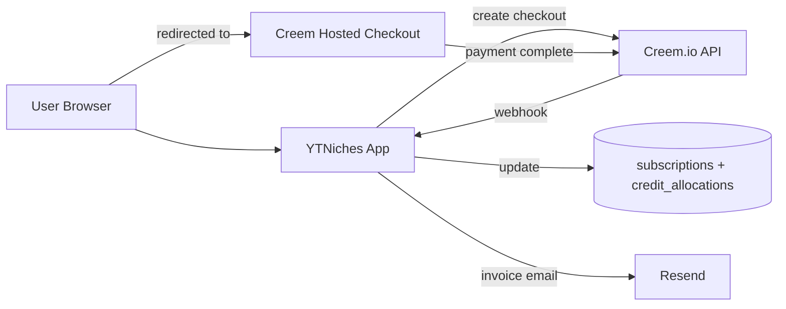

# YTNiches — Monetization

2026-09-19 · @Someone

---

## 1. Overview & Business Model

YTNiches is a subscription SaaS with credit-metered usage on top of the base plan. Users pay a monthly (or annual) fee for tier access + a monthly credit allocation. Credits meter the expensive actions (AI generation, high-cost API calls) so heavy users don't blow up unit economics.

### 1.1 Business model at a glance

- **Model:** Freemium-less trial + tiered subscription with metered credits
- **Trial:** 14-day free trial of Pro tier (no credit card required, one-time per email)
- **No permanent free tier** — rationale below
- **Billing frequency:** monthly (default) + annual (2 months free, 16.7% discount)
- **Currency:** USD (primary); Creem MoR handles conversion for international customers
- **Provider:** Creem.io (Merchant of Record, per DECISIONS.md D-010)

### 1.2 Why no permanent free tier

Every YTNiches action has real marginal cost:

- Niche search: \~$0.01 (YouTube API, aggressively cached)
- Prompt generation: \~$0.10 (AI provider dominates)
- Ongoing channel polling: \~$0.02/month per tracked channel

A permanent free tier attracts free-tier abuse (bots + serial trial-restarters), which for a tool with per-action AI cost turns into a cash drain rather than a growth funnel. The 14-day trial gives users the full Pro experience — they see the value — then convert to a paid tier they can afford.

**Marketing implication:** the landing page's "Sign up free" copy is honest — the trial IS free. The messaging just doesn't lie about permanent free access.

### 1.3 Unit economics thinking

Target gross margin: **\~75–85% at every paid tier.**

Cost per user per month, roughly (Pro tier example):

| Cost driver | Estimate |
| --- | --- |
| AI generation (100 prompts) | \~$10 |
| YouTube API (heavily cached) | \~$1 |
| Hosting + infra (Supabase, Vercel, Redis, Resend) | \~$1 |
| Creem MoR fee (3.9% + $0.40 on $49) | \~$2.30 |
| **Total cost per Pro user/month** | **\~$14.30** |
| **Revenue per Pro user/month** | **$49** |
| **Gross margin** | **\~71%** |

Starter and Team similar margins by design. Free trial cost is limited by trial credits (see §3).

### 1.4 Positioning against named competitors

Mac's positioning (DECISIONS.md D-002): Research + Execution, not just research. Pricing reflects this:

- Starter tier undercuts research-only competitors on price when compared feature-to-feature
- Pro tier matches or slightly beats research-only competitors on price, delivers 3x more value (execution features included)
- Team tier has no direct competitor equivalent — defensible pricing based on team utility

> **Open:** Actual Nexlev / OutlierKit / TubeLab pricing needs benchmarking to confirm this positioning. Add to DECISIONS.md as a sub-question of D-011.

### 1.5 Revenue targets (illustrative, not committed)

Mac to set actual targets. As a directional model:

| Milestone | Users mix | Approx MRR |
| --- | --- | --- |
| 100 paid | 60 Starter, 30 Pro, 10 Team | $3,610 |
| 500 paid | 250 Starter, 200 Pro, 50 Team | $19,600 |
| 1000 paid | 500 Starter, 400 Pro, 100 Team | $39,200 |
| 2500 paid | 1250 Starter, 1000 Pro, 250 Team | $98,000 |

## 2. Tier Structure

One trial state + three paid tiers. Monthly + annual billing on all paid tiers.

### 2.1 No Free Trial

### 2.2 Starter — $19/mo ($190/year, save $38)

For solo creators exploring a niche or starting fresh.

- **Credits:** 200 / month
- **Tracked channels:** up to 10
- **Refresh cadence:** every 24 hours
- **Niche Finder:** unlimited within credits (\~200 searches at 1cr each)
- **AI Prompts:** unlimited within credits (\~40 generations at 5cr each)
- **Competitor Tracking:** included, up to 10 channels
- **Outlier Finder (Phase 2):** included, uses credits
- **Notifications:** in-app only
- **Support:** email, 48-hour response
- **Team features:** none

### 2.3 Pro — $49/mo ($490/year, save $98)

For active creators or small operators running one channel seriously.

- **Credits:** 1,000 / month
- **Tracked channels:** up to 50
- **Refresh cadence:** every 6 hours
- **Everything in Starter, plus:**
- **Priority AI generation:** faster generation queue during peak load
- **Notifications:** in-app + email digest + real-time email option
- **Support:** email, 24-hour response
- **Advanced filters:** additional Niche Finder filters (Phase 2)
- **Team features:** none (need Team tier)

### 2.4 Team — $99/mo for 3 seats, +$25 per additional seat ($990/year for 3 seats, save $198)

For small teams running multiple channels or an agency operation.

- **Credits:** 3,000 / month (shared across workspace)
- **Tracked channels:** up to 100 (workspace-wide)
- **Refresh cadence:** hourly
- **Everything in Pro, plus:**
- **Workspace collaboration** (Phase 3): shared tracked channels, shared prompt library, shared notes
- **Tasks** (Phase 3): assign work to workspace members
- **Content Calendar** (Phase 3): 30–90 day scheduling with drag-and-drop
- **Slack notifications** (Phase 3)
- **Impersonation-safe roles:** admin / editor / viewer
- **Support:** priority email, 12-hour response, optional 30-min onboarding call

### 2.5 Feature matrix (quick reference)

| Feature | Starter | Pro | Team |
| --- | --- | --- | --- |
| Monthly credits | 200 | 1,000 | 3,000 |
| Tracked channels | 10 | 50 | 100 |
| Refresh cadence | 24h | 6h | 1h |
| AI Prompts | ✓ | ✓ | ✓ |
| Competitor Tracking | ✓ | ✓ | ✓ |
| Outlier Finder (Phase 2) | ✓ | ✓ | ✓ |
| Email notifications | – | ✓ | ✓ |
| Slack notifications | – | – | ✓ |
| Workspace / Team (Phase 3) | – | – | ✓ |
| Content Calendar (Phase 3) | – | – | ✓ |
| Tasks (Phase 3) | – | – | ✓ |

### 2.6 Annual billing

- Annual price = 10 × monthly (save 2 months = 16.7% discount)
- One upfront charge, one-year subscription
- Cancel anytime, refund pro-rated for unused whole months
- Only annual users get access to the annual-only promo (1-year Pro at Starter rate, if we ever run one)

### 2.7 Discounts (long-term thinking)

- **Student discount** (50% off Starter): verified via `.edu` email or SheerID (revisit at scale)
- **Non-profit** (30% off): revisit at scale, manual approval
- **Annual billing** (16.7% off): automatic, no code
- **Launch promo** (first 100 paid users): 20% off first year, code `EARLY100`, manually revocable

> **Open:** Actual pricing numbers ($19 / $49 / $99) are Claude's recommendation grounded in cost model + market positioning. Mac to confirm or override once benchmarking against Nexlev / OutlierKit / TubeLab is done. Structure holds regardless of final numbers.

## 3. Credit System

Credits meter the actions that have real marginal cost. The credit unit exists so pricing scales fairly with usage without forcing an expensive metered billing model.

### 3.1 Cost per action

| Action | Cost (credits) | Rationale |
| --- | --- | --- |
| Niche search | 1 | YouTube API cost dominates; heavily cached |
| Add channel to tracking | 1 | One-time fetch |
| Prompt generation | 5 | AI API cost dominates (\~$0.10 per call) |
| Regenerate prompts (with feedback) | 3 | Cheaper than fresh generation (partial reuse) |
| Outlier scan on tracked channel (Phase 2) | 2 | Cost of AI classification + baseline calc |
| Thumbnail idea generation (Phase 2) | 5 | Same AI cost as prompt generation |
| Export results (CSV, JSON) | 0 (free) | Data user already has access to |
| View channel detail / video list | 0 (free) | Served from cache |
| Browse Niches / Channels / Outliers feeds, niche detail | 0 (free) | Served from our DB. Starter/Trial see the top 50 niches, Pro/Team see all (D-072) |
| Save channel to workspace | 0 (free) | DB-only operation |
| Notification delivery | 0 (free) | Email cost negligible |

### 3.2 Credit allocation by tier

| Tier | Credits / cycle | Cycle length |
| --- | --- | --- |
| Trial | 50 total | Once (14 days) |
| Starter | 200 | Monthly |
| Pro | 1,000 | Monthly |
| Team | 3,000 | Monthly (workspace-shared) |

Annual subscribers get the same monthly allocation, just paid annually.

### 3.3 Credit lifecycle

- Allocated at cycle start (billing anniversary)
- Consumed by user actions (see §3.1)
- Refunded automatically if action fails (e.g. AI generation errors, video unavailable)
- Unused credits: DO NOT ROLL OVER by default (reset at cycle end)
- **Exception:** Team tier allows up to 500 unused credits to roll over one month (single-cycle rollover; not stackable across multiple months)

### 3.4 What happens when credits run out

- Free actions still work (viewing, saving, exporting existing data)
- Metered actions blocked with inline upgrade prompt
- Upgrade path: buy top-up pack (§3.5) OR upgrade to next tier (pro-rated)
- Never: silent overage charge (surprise billing kills trust)

### 3.5 Credit top-ups

One-time purchases for users who need more credits without upgrading tier.

| Pack | Credits | Price | Cost per credit |
| --- | --- | --- | --- |
| Small | 100 | $10 | $0.10 |
| Medium | 500 | $40 | $0.08 |
| Large | 2000 | $120 | $0.06 |

- Top-up credits added to user's balance; consumed AFTER monthly allocation
- Top-up credits DO NOT expire (unlike monthly allocation)
- No auto-buy; user must explicitly purchase

### 3.6 Fair-use protections

Even within credit limits, we protect against pathological usage:

- **Max prompt generations per day:** 100 (Team), 30 (Pro), 10 (Starter), 5 (Trial) — protects AI cost during a bad-day scenario
- **Max niche searches per hour:** 60 across all tiers — prevents scraping-like patterns
- **Max channels per workspace member (Team):** 20 personal + shared workspace limit

Exceeding these = friendly error "You've hit today's limit. Resets at midnight PT." Not credit consumption.

### 3.7 Credit event ledger

Backed by `credit_events` table (Backend-Schema.md §2.5). Every credit movement (allocation, consumption, refund, top-up, expiration) is a row — balance is derived, never stored. This makes:

- Auditing easy (why is my balance X?)
- Refunds atomic (insert a positive-amount row)
- Support debugging simple (see the whole trail)

### 3.8 UI display

- Top bar shows current balance always: "1,247 credits" (from Design-System / UI-UX-Flow)
- Clickable to open billing quick-view
- Warning color when balance < 20% of monthly allocation
- Zero balance shows upgrade CTA in place of number

### 3.9 Grandfathering

When credit costs change (Mac lowers or raises a per-action cost), grandfathering rules:

- **Cost drop:** applies to everyone immediately (win for users)
- **Cost increase:** grandfathered for existing paid users for 90 days; new users pay new cost immediately; existing users notified in-app + email 30 days before change takes effect for them

## 4. Creem.io Integration

Creem is the billing provider (DECISIONS.md D-010). Merchant of Record model: Creem is the legal seller, handles tax compliance, payment processing, refunds. We integrate via API.

### 4.1 What Creem provides

- **Merchant of Record:** handles global VAT/GST/sales tax; Mac doesn't file tax anywhere
- **Payments:** cards, wallets (Apple/Google Pay), 80+ currencies
- **Subscriptions:** recurring billing, trials, plan switching, cancellation, dunning
- **License keys:** optional; not used by YTNiches (session cookies do the work)
- **Webhooks:** for subscription lifecycle events
- **Fees:** 3.9% + $0.40 per transaction (all-in; no monthly fee, no extra tax processing fee)
- **Environments:** production (`api.creem.io`) + test (`test-api.creem.io`)

### 4.2 Integration architecture



### 4.3 Products + prices in Creem

Each subscription tier is a Creem Product with monthly + annual price variants:

| Creem product | Interval | Amount | Currency |
| --- | --- | --- | --- |
| `ytniches-starter` | month | 1900 (cents) | USD |
| `ytniches-starter` | year | 19000 (cents) | USD |
| `ytniches-pro` | month | 4900 (cents) | USD |
| `ytniches-pro` | year | 49000 (cents) | USD |
| `ytniches-team-3seats` | month | 9900 (cents) | USD |
| `ytniches-team-3seats` | year | 99000 (cents) | USD |
| `ytniches-team-additional-seat` | month | 2500 (cents) | USD |

Credit top-ups are one-time Creem products (not subscriptions):

| Creem product | Amount |
| --- | --- |
| `ytniches-credits-100` | 1000 (cents) = $10 |
| `ytniches-credits-500` | 4000 (cents) = $40 |
| `ytniches-credits-2000` | 12000 (cents) = $120 |

Product IDs stored in env vars, mapped in `lib/billing/products.ts`.

### 4.4 Checkout flow

1. User clicks Upgrade / Buy credits
2. App calls `POST api.creem.io/v1/checkouts` with product ID + user email + metadata (user\_id, tier)
3. Response includes hosted checkout URL
4. Redirect user to checkout URL
5. User completes payment on Creem's hosted page
6. Creem redirects user back to `https://ytniches.com/billing/success?session_id=...`
7. Our app polls / awaits webhook for confirmation
8. Webhook (see §4.5) is source of truth; success page shows processing state until webhook received

### 4.5 Webhooks

Creem sends webhooks for subscription lifecycle events. Handler: `POST /api/webhooks/creem`.

**Events we handle:**

| Event | What we do |
| --- | --- |
| `checkout.completed` | Create/update subscription row; allocate credits for the cycle |
| `subscription.created` | Same (redundant safety) |
| `subscription.updated` | Handle plan change; adjust credit allocation |
| `subscription.renewed` | Fresh credit allocation for new cycle |
| `subscription.cancelled` | Mark subscription cancelled; access continues until period end |
| `subscription.paused` | Pause access + credit consumption; retain data |
| `subscription.resumed` | Restore access |
| `payment.failed` | Enter dunning state; email user; keep access for 3 days |
| `payment.recovered` | Exit dunning; restore full access |
| `refund.issued` | Log refund; adjust credit balance (remove unused portion) |

**Security:**

- Verify `x-creem-signature` header on every request per Creem docs
- Reject stale events (> 5 min old)
- Idempotency via `provider_event_id` — duplicate webhook = no-op
- Store raw payload in `webhook_events` table for audit + replay (Security.md §4.8)

### 4.6 API authentication

- Use `x-api-key` header on every request
- Keys in env: `CREEM_API_KEY_PROD` + `CREEM_API_KEY_TEST`
- Test key used in dev + preview environments; production key only in production
- Never expose keys to client; all Creem calls from server

### 4.7 Customer portal

Creem provides a hosted customer portal where users manage:

- Payment methods
- Subscription status
- Invoices download
- Cancellation

Accessible from `/settings/billing` → "Manage subscription" button → redirect to Creem portal (short-lived signed URL).

### 4.8 Wrapper module

`lib/billing/creem.ts` abstracts every Creem call. Interface designed so provider swap (Creem → Paddle → Stripe) is one-file change:

```ts
export interface BillingProvider {
  createCheckoutSession(input: CheckoutInput): Promise<CheckoutSession>;
  createCustomerPortalUrl(userId: string): Promise<string>;
  getSubscription(providerSubscriptionId: string): Promise<Subscription>;
  cancelSubscription(providerSubscriptionId: string, atPeriodEnd: boolean): Promise<void>;
  verifyWebhook(payload: string, signature: string): boolean;
  parseWebhookEvent(payload: string): WebhookEvent;
}
```

Creem is the default implementation. Any future provider swap only touches this file + env vars.

## 5. Trial, Upgrade & Downgrade Flow

### 5.1 Trial start

- User signs up (Google OAuth or email + password)
- Trial state activated: 14-day countdown starts, Pro tier access enabled, 50 credits allocated
- No credit card required
- Trial start event logged (`trial_started`)
- No confirmation email needed for trial start (welcome email covers this)

### 5.2 Trial in progress

- User has full Pro access + 50 credits
- Top bar shows: "Trial: 12 days left · 48 credits"
- Warning banner appears at day 7 remaining, day 3, day 1
- Warning color intensifies (info → warning → error) as trial approaches end
- Email nudges: day 3 remaining ("how it's going?"), day 1 remaining ("trial ends tomorrow")

### 5.3 Trial end (no upgrade)

- Account moves to `expired_trial` state
- Access reduced to read-only:
  - Can view: past niche searches, saved channels, generated prompts
  - Cannot: create new searches, generate prompts, add channels
- Persistent banner top of every page: "Your trial ended. Upgrade to keep going."
- Data retained (soft-deletion clock starts only after 90 days of inactivity)
- Email sent: trial ended, upgrade link inside

### 5.4 Upgrade from trial → paid tier

- User clicks Upgrade anywhere in app → opens `/settings/billing` OR pricing modal
- Pricing modal shows 3 tiers side-by-side with recommended ("Pro") highlighted
- User picks tier + billing frequency (monthly / annual)
- Redirect to Creem hosted checkout
- On success: webhook fires → subscription created → credits allocated → user redirected to `/dashboard` with confirmation toast

**If user upgrades DURING trial:**

- Trial days remaining are consumed by the new subscription (no double-charging for overlap)
- Trial credits (unused) roll into first cycle's allocation (bonus)

### 5.5 Upgrade between paid tiers (e.g. Starter → Pro)

- User clicks Upgrade in `/settings/billing`
- Creem handles proration: user charged difference for remaining days in cycle
- New tier's credits allocated immediately (pro-rated to remaining days)
- Confirmation email + in-app toast

### 5.6 Downgrade (e.g. Pro → Starter)

- User clicks Downgrade in `/settings/billing`
- Confirmation modal warns about lost features + credit reduction
- Downgrade takes effect at end of current billing period (user keeps paid-for access)
- Credit balance NOT reduced retroactively; new lower allocation kicks in at next cycle

### 5.7 Team plan seat management

- Team plan starts with 3 seats included
- Admin invites members via email (see UI-UX-Flow.md §8.2)
- Adding a 4th+ member triggers seat purchase confirmation:
  - "Adding \[name\] adds a seat at $25/month, pro-rated"
  - On confirm: Creem subscription updated, new charge processed
- Removing a member: seat count decreases at next billing cycle (no immediate refund; simpler UX)
- Seat count can never go below 3 while on Team plan

### 5.8 Upgrade prompts (in-app)

Contextual, never surprising. Placement:

| Location | Trigger | Prompt |
| --- | --- | --- |
| Niche Finder results | Free/trial user hits daily limit | "You've hit today's Trial search limit. Upgrade for 200/mo on Starter" |
| Prompt generation | User has < 5 credits | "Only 4 credits left. Buy more or upgrade" |
| Add channel | User hits tier tracking limit | "You're at 10/10 tracked channels. Upgrade for 50 (Pro)" |
| Trial end banner | Trial expired | Persistent "Upgrade to keep going" |
| Settings > Billing | Manual review | Full pricing table |

Never: modal takeovers on non-billing pages, autoplay upgrade videos, dark patterns.

### 5.9 Annual switching

- User on monthly can switch to annual anytime
- Creem calculates unused monthly portion as credit toward annual charge
- New annual cycle starts on switch date
- Credit allocation resets to new cycle start

## 6. Refunds, Cancellation, Dunning & Edge Cases

### 6.1 Cancellation policy

- User can cancel any time from `/settings/billing` → "Cancel subscription"
- Confirmation modal: "You'll keep access until \[end of current period: date\]. Cancel anyway?"
- On confirm: Creem subscription cancelled at period end (not immediate)
- Access remains through end of period; credits usable until then
- After period end: account moves to `expired` state (same as trial ended)
- Data retained per Backend-Schema.md §6.4 retention policy
- No cancellation fee

### 6.2 Refund policy (public)

- **14-day money-back guarantee** on first purchase (monthly or annual)
- After 14 days: no refunds on monthly plans
- Annual plans: pro-rated refund of unused whole months if cancelled within first 30 days
- **Exceptions** (case-by-case, Mac approves):
  - Billing error (double-charge, wrong tier)
  - Extended service outage
  - Documented account compromise

Public refund policy on `/legal/refunds` page.

### 6.3 Refund process

1. User emails support requesting refund (or Mac initiates from admin)
2. Mac reviews eligibility per §6.2
3. From admin panel → user detail → "Issue refund" button
4. Backend calls Creem refund API; Creem processes refund to original payment method
5. Webhook confirms refund; subscription state updated; credit balance adjusted (unused portion removed)
6. Refund email sent to user with confirmation

### 6.4 Dunning (failed payments)

Creem handles payment retry logic. Our side:

- Day 0: payment fails → webhook `payment.failed` → email user with update-card link
- Day 0–3: full access continues ("grace period")
- Day 3–7: access limited (banner "Payment failed, please update your card") — read-only + prompt generation disabled
- Day 7+: full access suspended until payment recovered
- Day 21+: subscription cancelled automatically (Creem's default retry window ends)
- Cancellation via dunning is not a refund — user just stops being charged

### 6.5 Pausing subscription

Creem supports subscription pause. UX:

- User clicks "Pause" in `/settings/billing`
- Options: pause for 1 / 2 / 3 months
- During pause: no charges, no credit allocations, read-only access
- Auto-resume at end of pause period (charge resumes)
- One pause per 12-month period (prevent abuse)

### 6.6 Team plan edge cases

- **Owner leaves the workspace:** ownership transferred to next admin, or if none, subscription remains but ownership must be claimed
- **All members removed:** subscription auto-cancelled at period end
- **Payment method fails on Team plan:** all members lose access simultaneously (workspace-wide suspension per dunning schedule)

### 6.7 Chargebacks

- Chargeback received via Creem webhook
- Immediate access suspension for the user
- Account flagged in admin panel (persistent yellow marker)
- Mac reviews and decides: contest via Creem, or accept + ban
- Repeat chargebacks (2+) → permanent ban on email + payment method fingerprint

### 6.8 Tax + invoicing

- Creem handles all tax: adds VAT/GST/sales tax to displayed price at checkout based on customer location
- Creem issues tax-compliant invoices
- User accesses all invoices in Creem customer portal (linked from `/settings/billing`)
- No tax handling on our end; no VAT number storage; no tax filings by Mac

### 6.9 Data + billing separation

- User account (auth, prompts, notes) is separate from subscription (Creem-managed)
- Deleting account: cancels subscription first (webhook), then deletes user data (Backend-Schema.md §6.4)
- Deleting subscription: only ends billing; account and data preserved
- Users can have zero active subscription with data intact (expired state)

### 6.10 Fraud + abuse

- Trial abuse detection: same email + IP + fingerprint = same person; multiple trial attempts flagged
- Credit consumption anomalies (see Implementation-Plan.md §6): auto-flag for review
- Bulk signup patterns: rate limit + CAPTCHA per Security.md §4.7
- Confirmed abuse: ban user + refund any charges (fraud = void, not disputed)

### 6.11 Discount + coupon handling

- Coupons created in Creem admin (percent-off or fixed-amount, with expiry + usage cap)
- Applied at checkout via URL param or manual entry
- Stacking rules: never stack multiple discounts on same subscription
- Grandfathering: existing subscribers keep their locked-in price when general pricing changes; discounts do not persist across plan changes

---

**Doc dependencies:** Backend-Schema.md §2 for subscription/credit tables, TRD.md §6.3 for billing wrapper, Security.md §4.8 for webhook handling, UI-UX-Flow.md §8.1.3 for billing settings screen.
