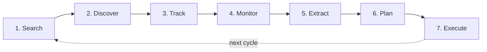

# YTNiches — Product Requirements Document (PRD)

2026-09-19 · @Someone

---

## 1. Product Overview

**Name:** YTNiches

**One-liner:** The command center for faceless YouTube creators — find profitable niches, spy on winners, and ship 30–90 days of content without switching tools.

**Elevator pitch:** YTNiches combines YouTube niche research (competitor tracking, outlier detection) with an execution layer (AI-generated prompts, content calendar, team workspace). Nexlev, OutlierKit, and TubeLab stop at "here's a niche." YTNiches goes from niche discovery to content shipping in one product, at a lower price point.

**Target market:** Faceless YouTube creators — AI-voice explainer channels, compilation channels, documentary/history channels, sleep music, kids stories, tutorial channels, and similar formats.

**Voice:** Founder-first (Mac's personal voice, warm and opinionated — modeled on Fibery's approach, not corporate SaaS).

**Current stage:** Rebuild in progress. Previous MVP was abandoned mid-build. New attempt starts from a locked design system and doc-first workflow — every decision written down before code, phased delivery with checkpoints to prevent drift.

## 2. Founder Story

Mac started a faceless YouTube channel. Finding a niche was the first wall. He eventually picked one — but the moment he had it, he realized he had no idea what to do next. How do you actually spy on competitors? How do you know which of their videos are outliers versus normal traffic? How do you extract what's working and turn it into your own scripts?

Every tool he tried helped with step 1 (finding a niche) and stopped there. The tools left him at the front door of the niche and walked away.

He dropped the channel. Then decided: this is the product that should exist. Not another niche finder — one that keeps going, from discovery to shipping.

That "left at the front door" moment is YTNiches' entire reason to exist.

> **Status:** Paraphrase. This section is a placeholder anchored to what Mac shared in the strategy session on 2026-09-19. Rewrite in Mac's first-person voice during the landing-copy phase (with specifics: which niche, the strongest "stuck" moment, contrarian opinion on faceless-creator advice).

## 3. Positioning & Competitive Landscape

**Positioning statement (working):** "Every tool helps you find a niche. Then leaves you stranded. YTNiches doesn't."

**Core differentiator:** Research + Execution — not just research.

**Named competitors and where they stop:**

| Competitor | Focus                           | What they don't do                                    |
| ---------- | ------------------------------- | ----------------------------------------------------- |
| Nexlev     | Niche finding + outliers        | No AI prompts, no content calendar, no team workspace |
| OutlierKit | Outlier detection               | No niche research beyond outliers, no execution layer |
| TubeLab    | Niche finding + competitor data | No AI prompts, no content planning                    |

All three focus on **niche finding and outliers**. None extends into what the founder story identifies as the real pain — competitor spying, prompt generation, content calendar, team collaboration.

**YTNiches full loop (the moat):**

1. Search — user inputs criteria (keyword, sub range, upload frequency, language, country)
2. Discover — surface matching niches and channels
3. Track — add channels to watchlist
4. Monitor — see when tracked channels post, hit view spikes, or change cadence
5. Extract — outlier detection + AI-generated prompts from winning videos
6. Plan — 30–90 day content calendar built from extracted ideas
7. Execute — workspace, tasks, team collaboration

Steps 1–2 are what competitors cover. Steps 3–7 are YTNiches' moat.

**Pricing positioning:** Below the three named competitors on entry tier. Rationale: value spans research + execution, so lower entry price undercuts the "research-only" comparison, and higher tiers capture value through execution and team features.

> **Open:** Actual pricing of Nexlev / OutlierKit / TubeLab needs benchmarking before final tiers are set. Tracked in DECISIONS.md.

## 4. Target User & Jobs to Be Done

**Primary user:** Faceless YouTube creator — someone building a channel where they are not on camera, using scripts + voiceover + stock footage / AI visuals / compilation content.

**Common formats they run:**

- AI-voice explainer channels (facts, history, science, top-10 lists)
- Compilation channels (reddit stories, movie clips, sports plays)
- Documentary / history channels
- Sleep music, meditation, ambient
- Kids stories, animated shorts
- Tutorial channels
- Reaction / commentary channels

**Sub-personas:**

| Persona          | Situation                                               | What they need most                                      |
| ---------------- | ------------------------------------------------------- | -------------------------------------------------------- |
| **The Explorer** | New to YouTube, no channel yet, trying to pick a niche  | Niche Finder + confidence that the niche has real demand |
| **The Stuck**    | Has a channel + niche, growth is flat, doesn't know why | Outlier Finder + Competitor Spy + AI Prompts             |
| **The Grower**   | Channel is growing, needs to systematize output         | Content Calendar + AI Prompts                            |
| **The Operator** | Runs multiple channels or manages a small team          | Workspace + Tasks + Calendar                             |

**Jobs to Be Done:**

- When I'm exploring, I want to find niches with real demand and manageable competition, so I can commit without wasting months on a bad pick.
- When I've picked a niche, I want to see who's winning in it and why, so I know what actually works before I invest.
- When a competitor's video takes off, I want to understand what made it work, so I can create something similar without blind copying.
- When I have a backlog of ideas, I want them scheduled and prioritized, so I ship consistently instead of dropping off.
- When my team works with me, I want them to see the plan without me explaining it, so execution isn't gated on me.

**Current tools they cobble together:**

- Niche research: Nexlev / OutlierKit / TubeLab / VidIQ / TubeBuddy (or spreadsheets + manual scraping)
- Competitor tracking: manually subscribing + refreshing
- Prompts and scripts: ChatGPT / Claude, ad hoc
- Content calendar: Notion / Google Sheets / Trello
- Team collaboration: Slack + Google Docs

YTNiches replaces the research and planning parts of this stack. It does not attempt to replace video editing, voice generation, or publishing tools.

## 5. Core Product Loop

Every user, regardless of stage, moves through some version of this 7-step loop:

**Feature mapping:**

| Step        | User action                                                            | Feature that covers it                        |
| ----------- | ---------------------------------------------------------------------- | --------------------------------------------- |
| 1. Search   | Set criteria — keyword, sub range, upload frequency, language, country | Niche Finder                                  |
| 2. Discover | Browse matching channels with preview stats                            | Niche Finder results view                     |
| 3. Track    | Save channels to a watchlist                                           | Competitor Tracking                           |
| 4. Monitor  | See new videos, view spikes, cadence changes on tracked channels       | Competitor Tracking dashboard + Notifications |
| 5. Extract  | Detect outliers, generate AI prompts from winning videos               | Outlier Finder + AI Prompts                   |
| 6. Plan     | Turn extracted ideas into a 30–90 day schedule                         | Content Calendar                              |
| 7. Execute  | Assign tasks, collaborate, ship                                        | Workspace + Tasks                             |

**Key insight:** The loop is not one-way. Users can enter at any step and cycle back. A creator with an existing channel might skip step 1–2 and start at step 3 (track known competitors). A researcher exploring adjacent niches might loop back from step 5 to step 1. The UI should not force a linear path.

## 6. MVP Features (Phase 1)

Phase 1 covers steps 1–4 of the product loop plus partial step 5 (prompt extraction). Four features ship together: Niche Finder, Competitor Tracking, AI Prompts, Onboarding. Everything else is deferred.

---

### 6.1 Niche Finder

**Purpose:** Help the user discover YouTube channels that match a set of criteria — the entry point for niche research.

**User inputs (filters):**

- Keyword / topic (free text)
- Subscriber range (min–max)
- Average views per video (min–max)
- Upload frequency (uploads per week / month)
- Monetized status (yes / no / any)
- Language (multi-select)
- Country (multi-select)
- Channel age (created after date)

**System output (per channel result):**

- Channel avatar + name
- Subscriber count
- Total video count
- Average views per video (last 30 days and lifetime)
- Upload frequency
- Monetized indicator (from ads visible on recent videos)
- Language
- Country
- Channel creation date

**Actions per result:**

- Save channel (routes to Competitor Tracking watchlist)
- View details (drill-down page with channel's full video list)
- Add to workspace (Phase 3)
- Export selected results (CSV, JSON)

**Views:**

- Grid view (default) — cards with thumbnail + key stats
- List view — dense sortable table
- Comparison view — pick 2–3 channels for side-by-side

**Empty state:** "No channels matched your filters. Try widening subscriber range or removing country filter."

**Out of MVP scope:** RPM estimation. (Insights tags were deferred here originally. They now ship as the niche-level Opportunity Score and "why" chips; see §6.1.1.)

#### 6.1.1 Discovery feed (Niche Discovery Engine, D-069)

`/niches` opens on a browse feed, and the search described above becomes its **Search** tab. The feed has three other tabs:

- **Niches:** AI-clustered niches with a 0–100 Opportunity Score, a 7-day trend and two "why" chips.
- **Channels:** discovered channels. Each card shows avg views/video, days since start, uploads, outlier score and 4 popular videos.
- **Outliers:** a global feed of videos at ≥ 3× baseline.

A background engine refreshes the data daily. Browsing costs 0 credits and 0 YouTube quota (D-072). The full spec is `docs/Niche-Discovery-Engine.md`.

---

### 6.2 Competitor Tracking

**Purpose:** Monitor a saved set of channels for new videos, view spikes, and cadence changes.

**User actions:**

- Add channel to tracking (from Niche Finder result OR paste channel URL directly)
- Remove from tracking
- Set notification preferences per channel

**System behavior:**

- Poll tracked channels on a cadence (interval TBD per tier — see DECISIONS.md)
- Detect: new video published, view count spikes vs channel baseline, upload cadence change, subscriber milestones
- Log events to activity feed

**Dashboard views:**

- Overview: recent activity across all tracked channels (feed style)
- Per-channel drill-down: full video list + activity timeline
- Compare 2–3 tracked channels side by side

**Notifications (in-app only for MVP; email in Phase 2):**

- New video from tracked channel
- Video crosses view threshold
- Tracked channel changes upload cadence

**Actions per tracked channel:**

- View channel detail
- Extract prompts from a specific video (routes to AI Prompts)
- Remove from tracking
- Notes (personal annotations, private to user)

**Out of MVP scope:** Email + Slack notifications (Phase 2), automatic outlier detection (Phase 2, separate Outlier Finder feature).

---

### 6.3 AI Prompts Generator

**Purpose:** Turn a winning video into ready-to-use prompts for creating similar content in the user's own voice and style.

**User inputs:**

- Video URL (from tracked competitor OR pasted from YouTube)
- Optional: target audience / tone context

**System behavior:**

- Fetch video metadata: title, description, thumbnail, tags. No transcripts (D-067: the only way to get them for others' videos is an undocumented endpoint YouTube's policies forbid)
- Analyze: title pattern, thumbnail style, hook structure and script structure, inferred from the metadata above
- Generate prompts across five categories

**Generated prompt categories:**

- Title variants (5–10 alternatives)
- Thumbnail concept descriptions (3–5)
- Hook variants (3–5)
- Script outline (structured, not full script)
- Description template

**Output presentation:**

- Each generated section is copy-paste ready
- User can save prompts to their prompt library
- Prompts can be regenerated with feedback ("more casual", "shorter", "less clickbait")

**Prompt library:**

- Saved prompts (from any past generation)
- Pre-built starter prompts (curated by YTNiches) for common video types

**Out of MVP scope:** Full script generation (only outlines in MVP), thumbnail image generation (only text descriptions), voice-tone training on the user's past videos.

---

### 6.4 Onboarding

**Purpose:** Get a new user from signup to their first useful output within 5 minutes, so they experience value before hitting friction.

**Flow:**

1. Welcome — name, primary goal (Explorer / Stuck / Grower / Operator, in user-friendly wording)
2. (Removed, D-086: no YouTube account connection. YTNiches only uses public data through its own API key.)
3. First niche search — guided walkthrough with pre-filled sensible filters based on goal
4. First result save — user saves one channel to tracking
5. First prompt generation — pick a video from saved channel, generate prompts, see output
6. Upgrade prompt — after seeing value, natural CTA to paid tier (only if free trial expired or free tier hit limit)

**Design principle:** Show, don't tell. No feature tours or tooltips upfront — the user does the actions, output appears.

**Skip logic:** Power users who signed up from a comparison page or explicit CTA can skip to dashboard; onboarding is always discoverable via "?" menu.

## 7. Retention Features (Phase 2)

Phase 2 adds features that drive weekly return visits. Once users are hooked on the MVP loop, these give them reasons to come back regularly.

---

### 7.1 Outlier Finder

**Purpose:** Surface videos that dramatically over-perform vs a channel's baseline — where the real learning is.

**How it works:**

- For each tracked channel, calculate rolling baseline of average views per video
- Flag videos exceeding baseline by threshold X% (TBD)
- Rank by outlier score (percentage over baseline × recency weight)

**Outputs:**

- Outliers feed across all tracked channels
- Per-channel outlier list
- One-click "extract prompts from this outlier" → routes to AI Prompts

**Views:** Feed (chronological), Grid (top-scoring past 7/14/30 days; capped by the 30-day YouTube data limit, D-067), Trending (outliers gaining momentum right now).

---

### 7.2 Notifications

**Purpose:** Bring users back with timely, high-signal alerts about their tracked space.

**Channels:**

- In-app (real-time)
- Email (digest + real-time toggle per notification type)
- Slack (Phase 3 — team tier)

**Triggers:**

- New video from tracked channel
- New outlier detected on tracked channel
- Weekly digest (top outliers, top new videos, channel movement)
- Milestones (tracked channel hit subscriber threshold)

**User controls:** per-notification-type on/off, per-channel override, quiet hours (email), digest cadence (daily / weekly / off).

---

### 7.3 Thumbnail Ideas

**Purpose:** Turn thumbnail patterns from winning videos into ideas for the user's next thumbnail — without generating the image itself.

**How it works:**

- For a selected outlier video, analyze thumbnail composition, color palette, text style, subject placement
- Generate 3–5 text descriptions of alternative thumbnail concepts inspired by the pattern
- User copies each description to their own thumbnail tool (Canva, Photoshop, DALL·E, etc.)

**Out of Phase 2 scope:** Actual thumbnail image generation. Deferred until user demand and cost model justify it.

## 8. Team Features (Phase 3)

Phase 3 unlocks team-tier pricing and turns YTNiches from an individual tool into a small-team platform.

---

### 8.1 Workspace

**Purpose:** Shared space where multiple users collaborate on the same set of tracked channels, prompts, and calendar.

**Features:**

- Invite team members (email invite, role: admin / editor / viewer)
- Shared: tracked channels, saved prompts, calendar, notes
- Private: user's own drafts, personal notes
- Activity feed showing what teammates have done
- Comments on any object (channel note, prompt, calendar event)

---

### 8.2 Tasks

**Purpose:** Assign work to team members without leaving YTNiches.

**Task properties:**

- Title
- Assignee (workspace member)
- Due date
- Linked object (a channel, prompt, or calendar entry)
- Status (open / in progress / done)
- Comments

**Views:** My tasks, All team tasks, Tasks by status (kanban), Tasks by assignee.

---

### 8.3 Content Calendar (30–90 days)

**Purpose:** Turn extracted prompts and ideas into a scheduled publishing plan for the channel.

**Features:**

- Drag-and-drop scheduling on day / week / month view
- Each calendar entry: title, description, linked prompt(s), status, channel
- Color-coded by channel (for users managing multiple)
- Filter panel by status, assignee, channel (Notion Calendar style)
- Keyboard navigation
- Export to Google Calendar / ICS

**Status pipeline (left → right):** Idea → Scripted → Filmed → Edited → Published

**Empty state:** "No videos planned yet. Add your first from a saved prompt, or drag one from Outliers."

## 9. Admin Panel

Separate product surface for Mac (and any future ops team) to manage users, content, revenue, and system health. Never exposed to end users.

**Modules scoped so far:**

### 9.1 Dashboard

- KPIs: total signups, active users (DAU / WAU / MAU), MRR, churn rate, trial-to-paid conversion, top plans by revenue
- Recent activity feed (signups, cancellations, high-value events)
- Health signals: YouTube API quota usage, error rate, background job queue depth

### 9.2 Users

- User list with search + filters (plan, signup date, status, last-active date)
- Per-user detail: profile, plan, credit usage, tracked channels, activity log
- Admin actions: adjust plan, grant credits, suspend, refund, impersonate (for support debugging)
- CSV export

### 9.3 Blog CMS

- Post management: create, edit, publish, unpublish, schedule
- Categories + tags management
- Authors management (add, edit, deactivate)
- SEO metadata per post (meta title, meta description, OG image, canonical URL)
- Preview before publish

### 9.4 Revenue

- MRR chart with breakdown (new / expansion / contraction / churn)
- Per-plan revenue split
- Refunds tracker
- Failed payments queue (with retry actions)
- Coupons and promo code management

### 9.5 API Quotas

- YouTube API quota usage (daily budget, current spend, projected exhaustion time)
- Per-endpoint breakdown
- Alerts when approaching limits (email + in-app)
- Historical trend chart

### 9.6 \[Module 6 — undecided\]

> Mac left slot 6 open in the initial spec. Candidates to consider: Support / Tickets, Broadcast Notifications, Announcements, Feature Flags. Tracked in DECISIONS.md.

### 9.7 Tools (extra module)

- Data recompute triggers (recalculate outliers, refresh channel stats for a single channel or all)
- Cache management (clear specific cache keys or full flush)
- Feature flag controls (enable/disable features per user or globally)

### 9.8 Automation Tools (extra module)

- Scheduled job status (channel polling, email digests, weekly recomputes)
- Manual trigger for any scheduled job
- Job history + error logs
- Retry / cancel controls for failed jobs

**Access control:** Admin panel gated by role. Two roles: super-admin (Mac only initially) and staff (limited to user support + blog CMS). No admin-panel access from customer signup flow.

## 10. Traffic Layer (Marketing Site)

Public-facing pages that drive signups. Separate design language from the app — marketing warmth versus in-app functional utility.

---

### 10.1 Landing page

- **Style:** Fibery-inspired, Option A (ambitious execution — custom illustrations, interactive elements, video hero)
- **Voice:** Founder-first (Mac's personal voice)
- **Sections:** Hero, problem visualization (scattered-tools metaphor), interactive creator-type explorer, bento-grid features, view switcher, templates showcase, beginner-mode toggle, AI section, integrations, founder section, changelog, VS section, final CTA
- **Detailed spec:** Landing-Page-Spec.md (separate doc, to be written)

---

### 10.2 Blog

- **Style:** Backlinko-inspired structure
- **Structure:** Categories + tags filtering, multi-author with dedicated author pages, featured post at top, category-based sections on homepage
- **Individual post page:** Sticky TOC, author byline, related posts, embedded newsletter signup, product CTA at end
- **Tech:** MDX-based content in Next.js, authors stored as YAML files, client-side search via Fuse.js (Algolia later if catalog grows past \~200 posts)
- **SEO essentials:** RSS feed at `/blog/rss.xml`, sitemap auto-generated, canonical URLs, OG images per post

---

### 10.3 Free Tools

- Standalone SEO-focused pages, one tool per URL
- Each tool solves one small problem for faceless creators
- **Candidate tools (brainstorm needed, not final):** Channel Age Checker, Video Idea Generator, Title Analyzer, Thumbnail Grader, YouTube Tag Extractor, Niche Profitability Estimator
- **Page structure:** Hero + the tool + CTA to full YTNiches
- **Open decision:** Gated (require signup to use) vs open (no signup). Tracked in DECISIONS.md.

---

### 10.4 Tutorials

- Long-form guides on YouTube niche research + growth
- Same design language as blog
- Standalone URL structure (not nested under /blog)

---

### 10.5 VS pages (comparison)

- YTNiches vs Nexlev
- YTNiches vs OutlierKit
- YTNiches vs TubeLab
- Each page: hero + feature-by-feature comparison table + pricing comparison + CTA
- SEO-focused for competitor-brand queries

---

**Cross-page conventions:**

- Same navbar and footer across every marketing page
- Newsletter signup module reused everywhere content-heavy
- Product CTA at end of every content page (blog, tutorial, VS)

## 11. Success Metrics

Metrics grouped by lifecycle stage. Specific numeric targets are TBD — to be set after a 30-day post-launch baseline.

### Activation (does the user hit "aha")

- Time from signup to first niche search
- Percentage of signups completing onboarding step 5 (first prompt generated)
- Signups saving at least 1 channel within first session

### Engagement (do they come back)

- WAU / MAU ratio (stickiness)
- Days active per week (for weekly active users)
- Notification open + click rate

### Retention (do they stay)

- 7-day retention: signup → active on day 7
- 30-day retention: signup → active on day 30
- Cohort retention curves by signup week

### Monetization

- Trial-to-paid conversion rate
- MRR growth month over month
- ARPU by tier
- Net revenue retention (expansion vs churn)
- Churn rate (voluntary vs involuntary)

### Product health

- Feature adoption rate: percentage of paid users who use each feature at least weekly
- Core loop completion: does the user cycle Search → Discover → Track → Extract in their first week?

**Reporting cadence:**

- Weekly: activation + WAU
- Monthly: retention + MRR
- Quarterly: cohort deep-dive + churn analysis

> **Open:** Numeric targets for each metric. Set after 30-day baseline post-launch.

## 12. Out of Scope (MVP)

Features explicitly deferred so scope stays honest and the MVP ships on time.

**Deferred to Phase 2 or later:**

- RPM estimation per channel (needs backend scoring model)
- ~~Insights tags — "High profitability", "High demand"~~ shipped as the niche Opportunity Score (D-069, §6.1.1)
- Outlier Finder (Phase 2)
- Email + Slack notifications (Phase 2)
- Thumbnail Ideas (Phase 2)
- Workspace / Tasks / Content Calendar (Phase 3)
- Multi-language UI

**Deferred indefinitely (revisit only on strong user signal):**

- Full script generation (only outlines in MVP; full scripts need voice-tone training on the user's own content)
- Thumbnail image generation (only text descriptions; image generation needs a cost model that justifies it)
- Native mobile apps (mobile-web only)
- White-label / agency mode
- Public API for developers
- Direct YouTube publishing (upload from YTNiches)

**Rule of thumb:** If a feature needs backend infrastructure not yet built, or its ROI vs a competitor gap is unclear, defer it. Ship the core loop first, expand outward from real usage data.

## 13. Open Decisions

Decisions that must resolve before build starts on affected features. Cross-referenced in DECISIONS.md (to be created).

| Decision                 | Options                                                     | Impacts                                                | Priority                      |
| ------------------------ | ----------------------------------------------------------- | ------------------------------------------------------ | ----------------------------- |
| Billing provider         | Lemon Squeezy                                               | Backend integration, tax handling, checkout UX         | Blocks Monetization spec      |
| Pricing tiers            | Free / Starter / Pro / Team (structure TBD)                 | Landing pricing section, credit system, feature gating | Blocks Monetization + Landing |
| Credit costs per action  | Niche search, prompt gen, competitor add — credits per unit | Backend, UI credit displays, pricing pages             | Blocks Monetization           |
| Refresh cadence per tier | Free = X, Starter = Y, Pro = Z (hours or days)              | YouTube API cost model, backend jobs, feature gating   | Blocks Backend-Schema + TRD   |
| Free tools access        | Gated (require signup) / Open (no signup)                   | SEO strategy, funnel conversion                        | Blocks marketing site build   |
| OAuth as primary         | Google-only / Google + email+password                       | Onboarding UX, backend auth spec                       | Blocks Onboarding spec        |
| Admin module 6           | Support / Broadcast / Announcements / Feature flags / other | Admin panel spec                                       | Blocks admin build            |
| Blog author scope        | Solo (Mac only, day 1) / Multi-contributor from launch      | Blog schema, content workflow                          | Blocks Blog spec              |

**Decisions locked so far (out of open list):**

- Tech stack: Next.js + TypeScript + Tailwind + Supabase + Redis (Upstash) + Resend
- Landing style: Fibery-inspired, Option A (ambitious)
- Landing voice: Founder-first (Mac's personal voice)
- Core positioning: Research + Execution
- Blog reference: Backlinko structure (categories + tags + multi-author)
- Dashboard direction: Linear shell + Ahrefs research + Attio relational + Notion Calendar
- Theme: Dark mode default, light mode as option

**Process:** Each open decision gets its own entry in DECISIONS.md with options, tradeoffs, recommendation, and final call. This PRD updates as decisions close.

## 14. Constraints, Assumptions & Related Docs

**Constraints:**

- **YouTube Data API v3 quota:** default 10,000 units/day per project. Search operations cost 100 units each (so only 100 searches/day at default quota). Cost model must fit MVP within default OR budget for higher quota.
- **Team:** Mac (product + design + strategy) + one developer. All specs must be copy-paste ready for developer implementation.
- **Timeline:** Rebuild starts from Sept 2026 baseline. No hard external launch deadline — trading speed for correctness (a deliberate response to previous MVP failure).
- **Budget:** TBD — infrastructure, illustration, and potential contractor costs unclear.

**Assumptions:**

- YouTube API v3 remains available at current terms
- Supabase + Upstash + Resend + Next.js hosting costs stay startup-affordable through first \~1000 users
- Faceless creator market continues growing (AI content generation trend)
- Mac can commit \~30 hours/week to product + growth work

**Related docs (to be created):**

| Doc                    | Purpose                                               | Depends on                       |
| ---------------------- | ----------------------------------------------------- | -------------------------------- |
| DECISIONS.md           | Log of every open decision + resolution               | This PRD                         |
| Monetization.md        | Pricing tiers, credits system, billing spec           | DECISIONS (pricing + billing)    |
| Design-System.md       | Colors, typography, components, dark mode tokens      | This PRD                         |
| UI-UX-Flow.md          | Screen-by-screen user flows for each feature          | PRD + Design-System              |
| Application-Flow.md    | State transitions, routing, auth flow                 | UI-UX-Flow                       |
| Backend-Schema.md      | DB tables, relationships, indexes, RLS policies       | PRD + Monetization               |
| TRD.md                 | APIs, jobs, caching, integrations, rate limits        | Backend-Schema                   |
| Security.md            | Auth, RLS, PII, API keys, rate limiting, admin access | TRD                              |
| Landing-Page-Spec.md   | Full landing spec (sections, behavior, breakpoints)   | PRD + Landing-Copy               |
| Landing-Copy.md        | Every headline, subhead, body line, CTA               | Founder voice discovery complete |
| Illustration-Brief.md  | Style guide + list of illustrations needed            | Landing-Copy                     |
| Interaction-Spec.md    | Drag, hover, toggle animations with references        | Landing-Page-Spec                |
| Hero-Video-Script.md   | 60–90 second video script + storyboard                | Landing-Copy                     |
| Implementation-Plan.md | Phased build order + checkpoints                      | All specs                        |
| CLAUDE.md              | Meta-file for AI assistants working in the repo       | Everything above                 |

**Handoff:**

- Owner: Waris Jamil
- Developer: TBD (Claude Code with tighter checkpoints — open decision)
- Update cadence: PRD updated whenever an open decision closes or scope changes
