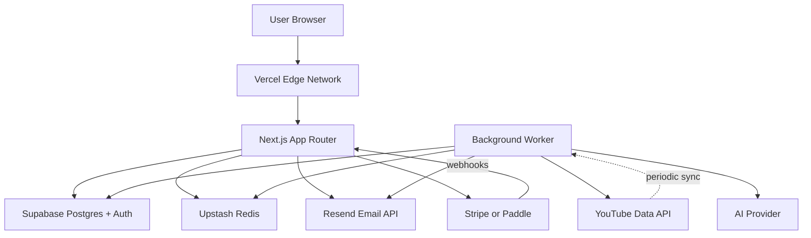

# YTNiches — Technical Requirements Document

2026-09-19 · @Someone

---

## 1. Overview & Architecture

YTNiches is a Next.js monolith deployed on Vercel with Supabase (Postgres + Auth), Upstash Redis (caching + rate limiting), and Resend (transactional email). Background jobs run on a dedicated worker (Inngest or Trigger.dev, chosen in §4).

### 1.1 Tech stack recap

| Layer                   | Choice                                       | Rationale                                          |
| ----------------------- | -------------------------------------------- | -------------------------------------------------- |
| Frontend framework      | Next.js 14+ (App Router)                     | Locked in D-001                                    |
| Language                | TypeScript strict                            | Type safety across full stack                      |
| Styling                 | Tailwind CSS + tokens from Design-System.md  | Locked in D-001                                    |
| Database                | PostgreSQL via Supabase                      | Locked in D-001                                    |
| Auth                    | Supabase Auth + Google OAuth                 | Locked in D-001                                    |
| Caching + rate limiting | Redis via Upstash                            | Locked in D-001                                    |
| Email                   | Resend                                       | Locked in D-001                                    |
| Background jobs         | Inngest or Trigger.dev (TBD)                 | Both are Vercel-friendly, event-driven             |
| Hosting                 | Vercel                                       | Deep Next.js integration                           |
| Observability           | Sentry + Vercel Analytics                    | Errors + web vitals                                |
| Analytics               | PostHog or Plausible (open)                  | See DECISIONS.md                                   |
| AI provider             | Anthropic Claude API (recommended) OR OpenAI | Choose in DECISIONS.md; interface abstracts either |
| Billing                 | Stripe or Paddle (D-010)                     | Interface abstracts both                           |

### 1.2 High-level architecture



### 1.3 Deployment environments

| Environment | Vercel project | Supabase project | Notes                                   |
| ----------- | -------------- | ---------------- | --------------------------------------- |
| dev         | `ytniches-dev` | `ytniches-dev`   | Every developer's local + shared dev DB |
| preview     | Per-PR         | `ytniches-dev`   | Reads dev DB; short-lived               |
| production  | `ytniches`     | `ytniches-prod`  | `main` branch only                      |

### 1.4 Repo structure

```
/
├─ app/                    # Next.js App Router pages
│  ├─ (marketing)/         # Public routes (landing, blog, tools)
│  ├─ (auth)/              # Signup, login, verify
│  ├─ (app)/               # Authenticated routes
│  └─ (admin)/             # Admin routes
├─ components/             # UI components (per Design-System.md)
│  ├─ ui/                  # Primitives (Button, Input, Card, Table…)
│  └─ features/            # Feature-specific composites
├─ lib/                    # Shared code
│  ├─ supabase/            # Supabase clients + typed queries
│  ├─ youtube/             # YouTube API wrapper + quota tracker
│  ├─ ai/                  # AI provider abstraction
│  ├─ billing/             # Stripe/Paddle abstraction
│  ├─ credits/             # Credit metering + balance
│  ├─ cache/               # Redis wrapper
│  └─ email/               # Resend wrapper + templates
├─ workers/                # Background job definitions
├─ supabase/migrations/    # SQL migrations
├─ tests/                  # Unit + integration
└─ docs/                   # All spec docs (PRD, DECISIONS, etc.)
```

## 2. Frontend Patterns

### 2.1 Rendering strategy

- **Marketing pages** (landing, blog, tools, VS) — static generation (`generateStaticParams`) with ISR (revalidate 60s) for blog posts
- **Auth pages** — server-rendered on demand
- **App pages** — server components by default for data fetch + auth; client components for interactivity
- **Admin pages** — server-rendered on demand, gated by middleware

### 2.2 Data fetching

- **Server components:** direct Supabase server client with user's session (typed queries via generated types)
- **Client components:** SWR (or TanStack Query — pick in DECISIONS.md) with typed hooks
- **Mutations:** Server Actions for form submissions; API routes for anything called from third parties (webhooks)
- **Real-time:** Supabase Realtime subscriptions for notifications feed + activity feed

### 2.3 State management

No global state library. State lives where it should:

- **Server state** — React Query / SWR cache
- **URL state** — filters, sort, pagination in query params
- **Component state** — `useState` / `useReducer`
- **Persisted user prefs** — `localStorage` via a small wrapper (theme, sidebar collapse, table density)

If a piece of state doesn't fit one of these, that's a design smell — don't reach for Zustand/Redux to avoid the question.

### 2.4 Forms

- Library: React Hook Form + Zod schemas for validation
- Schemas shared between client validation and server actions (single source of truth)
- Server actions return typed error objects that map to field-level messages

### 2.5 Routing conventions

- Route groups for auth boundaries (see §1.4 folder tree): `(marketing)`, `(auth)`, `(app)`, `(admin)`
- Middleware (`middleware.ts`) enforces:
  - Redirect unauthed users hitting `(app)/*` to `/login?redirect=<path>`
  - Redirect authed users hitting `(auth)/*` to `/dashboard`
  - Enforce super-admin role on `(admin)/*` → 403 if not

### 2.6 Loading + error boundaries

- Every route has a `loading.tsx` (skeleton matching the shape of the page)
- Every route has an `error.tsx` (fallback with retry action)
- Root `not-found.tsx` for 404s

### 2.7 Accessibility contract

Every merged component must pass:

- axe-core checks (via jest-axe in unit tests) — zero violations
- Keyboard navigation manually verified (Tab order, focus rings, Esc / Enter behaviour)
- Color contrast per Design-System.md §6.2

### 2.8 UI component primitives

`components/ui/` is built on **Radix UI** primitives (dialog, select, checkbox, switch, avatar, etc.) plus **cmdk** for the command palette (Design-System.md §5.6), scaffolded via the shadcn CLI and restyled entirely to Design-System.md's tokens/variants — shadcn's own defaults are not used as-is. Variant/className management via `class-variance-authority` + `clsx` + `tailwind-merge`. See DECISIONS.md D-023.

## 3. Backend & APIs

### 3.1 Service layer pattern

No Supabase queries in components or route handlers directly. All data access goes through a service layer under `lib/services/` — one file per domain (channels, prompts, credits, subscriptions, etc.).

**Service signature pattern:**

```ts
// lib/services/prompts.ts
export async function generatePrompt(
  ctx: RequestContext, // holds userId, tier, workspaceId
  input: { videoId: string; audience?: string; tone: Tone },
): Promise<Result<Prompt, GenerationError>>;
```

- `RequestContext` is constructed by middleware, carries user + tier + workspace
- Result type wraps success + typed error (no throws for expected errors)
- Services own: credit metering, cache reads/writes, external API calls, DB transactions

### 3.2 API surface

| Category                                       | Style                                     | Auth                                |
| ---------------------------------------------- | ----------------------------------------- | ----------------------------------- |
| Server Actions (called from client components) | Next.js Server Actions                    | Session cookie                      |
| Public API routes (webhooks)                   | Next.js Route Handlers                    | Signature verification per provider |
| Cron/worker triggers                           | Route Handlers protected by shared secret | Bearer token in header              |
| Admin actions                                  | Server Actions gated by super\_admin role | Session + role check                |

### 3.3 Error handling

**Categories:**

- **Expected errors** (rate limit, insufficient credits, invalid input) — return typed error object; UI renders specific message
- **Unexpected errors** (bug, third-party failure) — throw; caught by global handler; logged to Sentry; user sees generic "something went wrong"
- **Validation errors** (Zod parse failure) — return field-level error map; form displays inline

**Never:** swallow errors silently. Every catch either handles + logs, or rethrows.

### 3.4 Idempotency

Critical for billing + credit consumption + third-party writes. Pattern:

- Client generates `idempotency_key` (UUID) per action
- Server stores key on first request; subsequent identical requests return cached result
- Applied to: credit consumption (prevents double-charge), Stripe/Paddle subscription changes, prompt generation, webhook processing

### 3.5 Transaction boundaries

- Use Supabase transactions for any multi-table write that must succeed together (e.g. consume credit + insert prompt row)
- Never mix external API calls inside a DB transaction (holds connections)
- Pattern: DB transaction, then external call, then update state (with rollback path if external fails)

### 3.6 Webhook handling

- Every webhook endpoint verifies signature before processing
- Webhook payload stored raw in a `webhook_events` table (audit + replay)
- Processing is idempotent via `provider_event_id`
- Failed webhooks retry with exponential backoff (max 3 tries), then land in a manual review queue

## 4. Background Jobs

### 4.1 Job runner

**Recommendation:** Inngest.

Reasons: event-driven (fits our webhook + user-action model), Vercel-native, retries + observability built-in, generous free tier, TypeScript-first. Alternative: Trigger.dev (equivalent capabilities). Decision tracked as candidate for DECISIONS.md if not resolved.

### 4.2 Job catalog

| Job                            | Trigger            | Cadence                     | What it does                                                                 |
| ------------------------------ | ------------------ | --------------------------- | ---------------------------------------------------------------------------- |
| `channel.sync`                 | Scheduled per tier | 24h / 12h / 6h / 1h (D-013) | Fetch tracked channel's latest videos + stats, detect events                 |
| `outlier.scan`                 | Scheduled          | Daily (Phase 2)             | Recompute baselines, flag outliers on all tracked channels                   |
| `digest.email`                 | Scheduled          | Daily 8am user local        | Send email digest to users with digest enabled                               |
| `credit.expire`                | Scheduled          | Nightly                     | Expire unused credits per allocation rollover rules                          |
| `retention.enforce`            | Scheduled          | Nightly                     | Hard-delete soft-deleted records past grace period (see Backend-Schema §6.4) |
| `webhook.retry`                | Event-driven       | On webhook failure          | Exponential backoff retry (max 3), then manual queue                         |
| `prompt.generate`              | Event-driven       | On user submit              | Async because AI generation is 3–10s; UI polls or subscribes                 |
| ~~`youtube.transcript.fetch`~~ | Removed (D-067)    | —                           | No transcripts: YouTube Developer Policies forbid the unofficial endpoint    |
| `youtube-retention-cron`       | Daily              | 03:15 UTC                   | Purge YouTube data not refreshed in 30 days (III.E.4.d, D-067)               |
| `discovery-run`            | Scheduled          | Daily 20:00 UTC             | Search seeds → qualify → ingest new channels (D-069)                         |
| `enrichment-cron/batch`    | Scheduled          | Every 2h                    | Refresh due channels by tier, compute outliers → `outliers_feed`             |
| `classify-run`             | Scheduled          | Daily 22:00 UTC             | gpt-4o-mini niche label + embedding match (D-074)                            |
| `niches-snapshot`          | Scheduled          | Daily 01:00 UTC             | Opportunity Score + status per niche, cache warm, niche notifications        |
| `retention-purge`          | Scheduled          | Daily 03:00 UTC             | `purge_stale_youtube_data()` (D-073)                                         |

Discovery jobs share a budget guard: `used + cost ≤ DISCOVERY_DAILY_BUDGET`, which defaults to the daily limit − 500. They stop cleanly when the budget runs out. Every YouTube call records its source (`search`, `free_tools`, `channel_sync`, `discovery`, `enrichment`) in `quota:youtube:{date}:{source}`. See `Niche-Discovery-Engine.md` §6.

### 4.3 Job execution guarantees

- **At-least-once delivery** — all handlers must be idempotent (see §3.4)
- **Deduplication** — events with same key within a window collapse to one job
- **Retries** — 3 attempts with exponential backoff; failures land in dead-letter queue (visible in admin)
- **Timeouts** — 30s soft, 60s hard; long jobs explicitly opt into extended timeout

### 4.4 Scheduling model

- Cron jobs configured in `workers/cron.ts` using Inngest's schedule primitive
- Per-user scheduled jobs (like `channel.sync` per user's tier) scheduled with a `userId` in the event key so retries and dedup work per user
- Manual triggers from admin panel enqueue events with `admin: true` metadata for audit

### 4.5 Job observability

- Every job start + end logged with duration + input size
- Failures logged to Sentry with full context (job name, args, error)
- Admin panel → Automation Tools shows: currently running jobs, recent failures, last successful run per scheduled job

## 5. Caching & Rate Limiting

### 5.1 Cache layers

| Layer                                     | Where       | TTL                                 | Purpose                                          |
| ----------------------------------------- | ----------- | ----------------------------------- | ------------------------------------------------ |
| CDN                                       | Vercel edge | Per-page (marketing pages ISR 60s)  | Public content                                   |
| Next.js data cache                        | Server      | Per-fetch (opt-in via `revalidate`) | Server component fetches                         |
| Redis (Upstash)                           | Application | Varies by key type                  | YouTube data, rate-limit buckets, session extras |
| PostgreSQL (materialized views / rollups) | DB          | Per rollup job                      | Aggregates for admin metrics                     |

### 5.2 Redis key conventions

```
youtube:channel:{youtube_channel_id}              # TTL 6h (stats + metadata)
youtube:channel:{youtube_channel_id}:videos       # TTL 6h (recent video list)
youtube:video:{youtube_video_id}                  # TTL 12h (video metadata)
# (youtube:transcript:* removed, D-067; no YouTube data cached > 24h)

ratelimit:signup:{ip}                             # 5/hour window
ratelimit:login:{ip}                              # 5/15min window
ratelimit:niche_search:{user_id}                  # Per tier cap
ratelimit:prompt_gen:{user_id}                    # Per tier cap

session:extras:{user_id}                          # Ephemeral session data
credit:balance:{user_id}                          # TTL 60s (invalidated on credit_events insert)
```

### 5.3 YouTube API cost management

YouTube Data API v3 default quota: 10,000 units/day. Search costs 100 units, most other reads cost 1–10 units.

**Strategy:**

- **Never fetch what's cached fresh.** Every YouTube call goes through `lib/youtube/` wrapper which checks Redis first.
- **Batch endpoints where possible.** `videos.list` accepts up to 50 IDs at 1 unit total; fetch by batch not by loop.
- **Prefer `channels.list` over `search.list`** when we know the channel ID (1 unit vs 100).
- **Search is expensive.** Every Niche Finder query costs 100 units. Per-user daily search cap enforced (via ratelimit key) so runaway free-tier users can't exhaust quota.
- **Quota tracking:** every YouTube call increments a counter in Redis (`quota:youtube:{YYYY-MM-DD}`); admin sees live usage; alerts at 70% + 90% of daily budget.
- **Circuit breaker:** at 95% of daily quota, non-critical fetches (background outlier scans) pause; user-initiated searches continue until 100%; then return "Service busy, try again in \<hours>" until midnight PT reset.

### 5.4 AI provider cost management

- Each prompt generation costs money (per-token AI billing)
- Cost per generation tracked in `credit_events` metadata; cost per user aggregated per billing cycle
- Free tier: hard cap of X prompt generations per cycle (D-012)
- Alert (admin) if any user exceeds break-even cost for their tier
- Cost breaker per user: if a user hits break-even × 3 in a cycle (indicating abuse or bug), prompt generation disabled with support ticket auto-created

### 5.5 Rate limiting (Upstash's `@upstash/ratelimit`)

| Endpoint / action      | Limit              | Scope       | Response on limit                          |
| ---------------------- | ------------------ | ----------- | ------------------------------------------ |
| Signup                 | 5 / hour           | IP          | 429 + "Too many signups from this network" |
| Login                  | 5 / 15 min         | IP + email  | 429 + "Account locked, try password reset" |
| Password reset request | 3 / hour           | Email       | 429 silent (no user enumeration)           |
| Niche search           | Per tier (D-011)   | User        | Upgrade CTA                                |
| Prompt generation      | Per credit balance | User        | Credit-based, not rate-based               |
| Add tracked channel    | Per tier           | User        | Upgrade CTA                                |
| API webhook receiver   | 100 / min          | Provider IP | 429 + provider will retry                  |

## 6. Third-Party Integrations

Every integration goes through a wrapper module in `lib/` so provider swaps are localized.

### 6.1 YouTube Data API v3

- Wrapper: `lib/youtube/`
- Auth: API key (server-side only, never exposed to client)
- Quota tracking + rate limiting per §5.3
- Endpoints used: `channels.list`, `videos.list`, `search.list`, `commentThreads.list` (Phase 2 for insights)
- Transcript fetching: removed (D-067). YouTube's policies forbid the unofficial captions endpoint, and the official one needs the video owner's consent.

### 6.2 AI provider

- Wrapper: `lib/ai/`
- Interface abstracts provider so Claude ↔ OpenAI swap is one config change
- Provider recommendation: **Anthropic Claude API** for quality on structured extraction tasks; OpenAI as fallback
- Model tier by request type: cheaper model for title variants + hooks; higher-tier model for full outline generation
- Streaming: not needed for MVP (prompt generation is UI-poll based); consider for Phase 2

### 6.3 Billing provider

- Wrapper: `lib/billing/`
- Interface supports both Stripe and Paddle behind a single API
- Provider decided in D-010 (recommendation: Paddle for MoR model on a solo-founder SaaS)
- Webhook signature verification per provider
- Test mode used in dev + preview environments; production uses live keys

_(Note, 2026-09-22: D-010 resolved to Creem.io, not Paddle — full integration spec in Monetization.md §4. `BillingProvider` interface (Task 5) is still provider-agnostic per this section's intent; only the recommendation text above is stale.)_

### 6.4 Email (Resend)

- Wrapper: `lib/email/`
- Transactional templates in React Email (share styling with Design-System.md tokens)
- Templates: welcome, email verify, password reset, digest, notification, invoice, plan change, cancellation
- From address: `hello@ytniches.com` (transactional) + `updates@ytniches.com` (digests, opt-out easily)
- SPF + DKIM + DMARC records set up per Resend docs
- Bounce + complaint webhooks handled: hard bounces → mark email `undeliverable` on profile; complaints → unsubscribe from all non-critical email

### 6.5 Analytics

- Product analytics: PostHog or Plausible (decide in DECISIONS.md)
- Recommendation: **PostHog** if you want funnels, retention analysis, session replay (for onboarding debug); **Plausible** if you want just page views + privacy simplicity
- Events instrumented from MVP (per Implementation-Plan.md §3.4): `signup`, `first_search`, `first_save`, `first_prompt`, `upgrade_clicked`, `upgrade_completed`, `onboarding_skipped`, `notification_clicked`

### 6.6 Error monitoring (Sentry)

- Frontend + backend both integrated
- Source maps uploaded on deploy
- Sensitive data scrubbed: no email addresses, no auth tokens, no billing details
- Alerts to Slack for error rate spikes (per rollback trigger §6.1 in Implementation-Plan.md)

### 6.7 Slack (Phase 3)

- OAuth app for team-tier workspaces
- Delivers: notification digests, task assignments, tracked-channel alerts

### 6.8 Zapier (Phase 3, optional)

- Webhooks + public triggers for: new outlier, new tracked-channel activity, prompt generated
- No custom Zapier app in MVP; native Zapier `Webhook by Zapier` integration is enough

### 6.9 What we deliberately do NOT integrate

- Google Ads / Facebook Ads pixels on marketing (privacy-first stance; revisit if paid acquisition starts)
- Chatbot / live chat widgets (support via email in MVP)
- Full-text search provider (Fuse.js client-side is enough for blog; database FTS handles internal search)
